# Java后端技术体系全解析
## 上篇：核心技术基础
### 一、基础篇
#### 网络基础
##### 1. OSI与TCP/IP模型
| 模型层级 | OSI七层模型 | TCP/IP五层模型 | 核心设备/协议 |
|----------|-------------|----------------|---------------|
| 应用层   | 应用层、表示层、会话层 | 应用层 | HTTP、SMTP、DNS、FTP |
| 传输层   | 传输层 | 传输层 | TCP、UDP |
| 网络层   | 网络层 | 网络层 | ICMP、IP、路由器、防火墙 |
| 数据链路层 | 数据链路层 | 数据链路层 | 网卡、网桥、交换机 |
| 物理层   | 物理层 | 物理层 | 中继器、集线器 |

##### 2. TCP三次握手与四次挥手
###### TCP三次握手（建立连接）
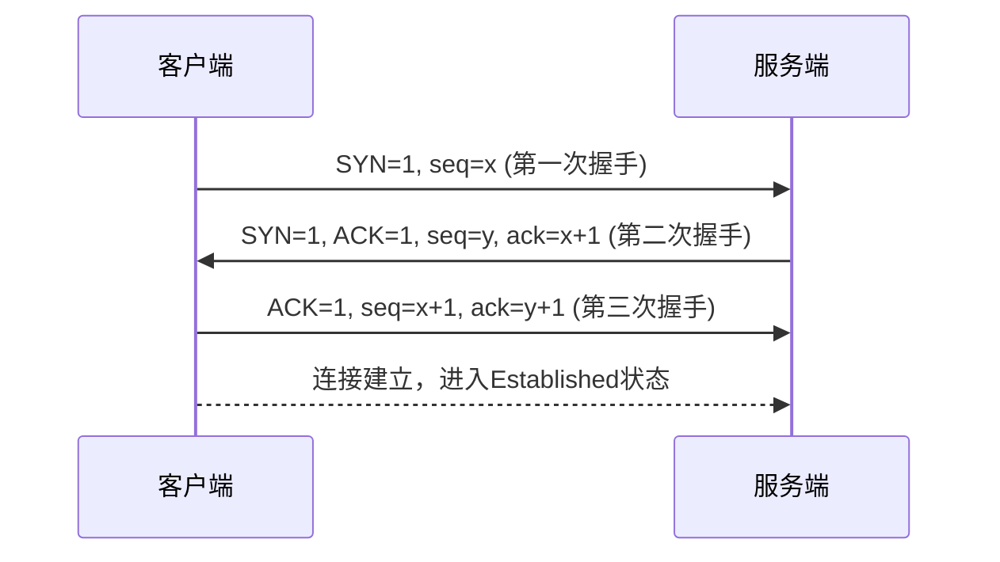
- **核心目的**：确保客户端与服务端同时具备发送和接收数据的能力
- **为什么需要三次**：
  1. 防止已失效的请求报文重复建立连接，浪费资源
  2. 两次握手只能保证单向连接畅通，三次握手才能相互确认序列号起始值

###### TCP四次挥手（关闭连接）
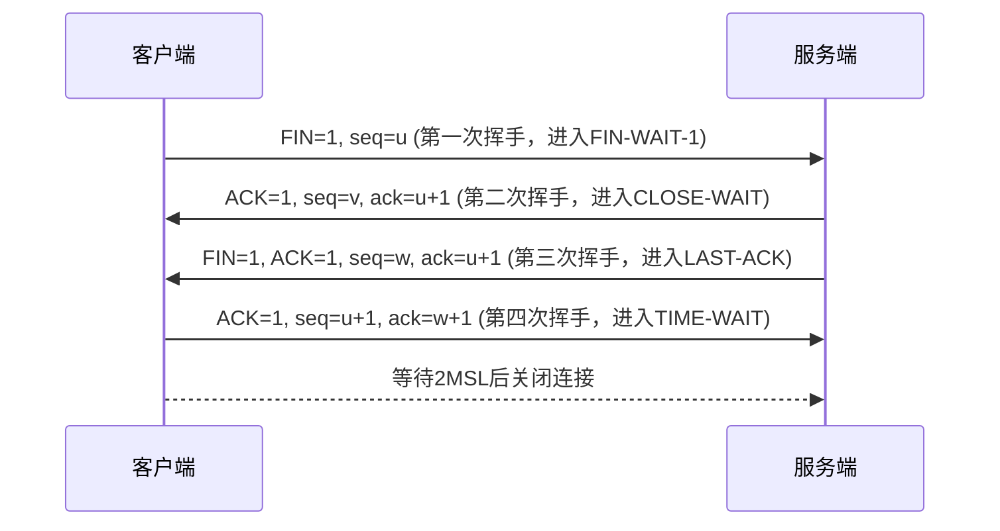
- **核心目的**：确保双方数据都能完整传输
- **关键状态说明**：
  - CLOSE-WAIT：服务端等待应用程序关闭连接
  - TIME-WAIT：防止网络丢包导致的连接异常，默认等待2MSL（最大报文生存时间）

##### 3. TCP与UDP区别及应用场景
| 特性         | TCP                  | UDP                  |
|--------------|----------------------|----------------------|
| 连接特性     | 面向连接             | 无连接               |
| 可靠性       | 可靠传输（校验和、重传、流量控制） | 不可靠传输           |
| 数据形式     | 字节流               | 数据报文段           |
| 传输效率     | 较低                 | 较高                 |
| 首部字节     | 20-60字节            | 8字节                |
| 应用场景     | 文件传输、邮件、HTTP  | 语音、视频、直播、DNS |
| 基于协议     | HTTP、FTP、SMTP      | RIP、DNS、SNMP       |

##### 4. TCP粘包问题
###### 产生原因
- 发送端：Nagle算法会合并小数据包，等待确认后一起发送
- 接收端：接收缓存速度大于应用程序读取速度，导致多个包缓存拼接

###### 解决方案
```java
// 方案1：包头+包体长度（推荐）
public class PacketProtocol {
    // 包头4字节，存储包体长度
    private int length;
    // 包体数据
    private byte[] data;

    // 编码：将数据转换为协议格式
    public byte[] encode(byte[] data) {
        ByteArrayOutputStream bos = new ByteArrayOutputStream();
        DataOutputStream dos = new DataOutputStream(bos);
        try {
            dos.writeInt(data.length); // 写入包体长度
            dos.write(data); // 写入包体数据
            return bos.toByteArray();
        } catch (IOException e) {
            throw new RuntimeException(e);
        }
    }

    // 解码：从字节流中解析出数据
    public byte[] decode(InputStream in) throws IOException {
        DataInputStream dis = new DataInputStream(in);
        int length = dis.readInt(); // 读取包体长度
        byte[] data = new byte[length];
        dis.readFully(data); // 读取包体数据
        return data;
    }
}
```

#### HTTP协议
##### 1. HTTP版本演进对比
| 特性         | HTTP/1.0 | HTTP/1.1 | HTTP/2.0 |
|--------------|----------|----------|----------|
| 连接方式     | 短连接   | Keep-Alive长连接 | 多路复用 |
| 传输格式     | 文本     | 文本     | 二进制   |
| 并发性能     | 低（每次请求新建连接） | 中（管道化） | 高（帧分帧传输） |
| 头部处理     | 无压缩   | 部分压缩 | 头部压缩 |
| 服务端推送   | 不支持   | 不支持   | 支持     |

##### 2. HTTP与HTTPS区别
| 特性         | HTTP                  | HTTPS                  |
|--------------|-----------------------|------------------------|
| 默认端口     | 80                    | 443                    |
| 数据传输     | 明文传输，安全性差     | SSL/TLS加密，安全性高   |
| 响应速度     | 快，资源消耗少        | 较慢，需加密解密       |
| 证书要求     | 无                    | 需CA证书               |

###### HTTPS连接建立流程
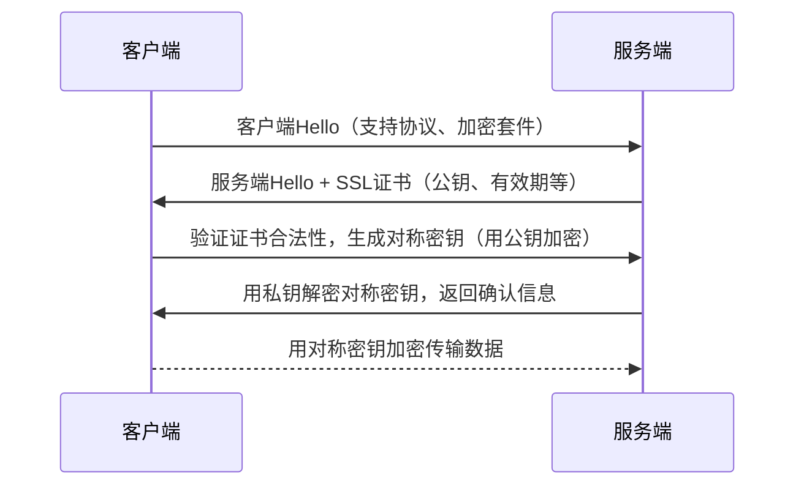

##### 3. Get与Post请求区别
| 特性         | Get                  | Post                  |
|--------------|----------------------|-----------------------|
| 数据可见性   | 数据在URL中，可见    | 数据在请求体中，不可见 |
| 安全性       | 较低（易被拦截）     | 较高                  |
| 数据长度限制 | 通常2KB              | 无限制                |
| 编码类型     | application/x-www-form-urlencoded | multipart/form-data |
| 缓存支持     | 支持缓存             | 不支持缓存            |

##### 4. 常见HTTP响应状态码
- **1xx（信息类）**：100 Continue（继续）
- **2xx（成功类）**：200 OK（请求成功）
- **3xx（重定向）**：301 永久重定向、302 临时重定向
- **4xx（客户端错误）**：400 语法错误、403 禁止访问、404 资源不存在
- **5xx（服务端错误）**：500 内部错误、502 网关错误

#### 操作系统基础
##### 1. 进程与线程区别
| 维度         | 进程                  | 线程                  |
|--------------|-----------------------|-----------------------|
| 资源分配     | 资源分配最小单位      | 任务调度最小单位      |
| 内存空间     | 独立地址空间          | 共享进程堆和方法区，私有栈和程序计数器 |
| 切换开销     | 大（需切换地址空间）  | 小（仅切换上下文）    |
| 通信方式     | IPC（管道、消息队列等） | 共享内存、ThreadLocal |

##### 2. 进程间通信方式（IPC）
| 通信方式     | 特点                  | 适用场景              |
|--------------|-----------------------|-----------------------|
| 管道（Pipe） | 半双工，FIFO顺序      | 亲缘进程通信          |
| 消息队列     | 结构化数据，非阻塞    | 跨进程数据传输        |
| 共享内存     | 最快的IPC方式         | 高并发数据共享        |
| 信号量       | 计数器，用于同步互斥  | 进程间资源竞争控制    |
| 套接字（Socket） | 支持跨网络通信      | 网络服务通信          |

##### 3. 页面置换算法
###### LRU（最近最久未使用）算法实现
```java
import java.util.LinkedHashMap;
import java.util.Map;
import java.util.Set;
import java.util.Iterator;

public class LRUCache<K, V> {
    private final Map<K, V> cache;
    private final int capacity;

    // 基于LinkedHashMap实现
    public LRUCache(int capacity) {
        this.capacity = capacity;
        // accessOrder=true：按访问顺序排序
        this.cache = new LinkedHashMap<K, V>(capacity, 0.75f, true) {
            @Override
            protected boolean removeEldestEntry(Map.Entry<K, V> eldest) {
                // 当容量超过阈值时，移除最久未使用的元素
                return size() > capacity;
            }
        };
    }

    public V get(K key) {
        return cache.getOrDefault(key, null);
    }

    public void put(K key, V value) {
        cache.put(key, value);
    }

    public static void main(String[] args) {
        LRUCache<Integer, String> cache = new LRUCache<>(3);
        cache.put(1, "A");
        cache.put(2, "B");
        cache.put(3, "C");
        System.out.println(cache.get(1)); // 访问1，变为最近使用
        cache.put(4, "D"); // 容量超3，移除最久未使用的2
        System.out.println(cache.get(2)); // null
    }
}
```

##### 4. 死锁条件与解决方式
###### 死锁四大必要条件
1. 互斥条件：资源只能被一个进程占用
2. 请求与保持条件：持有部分资源并请求其他资源
3. 非剥夺条件：资源不能被强制剥夺
4. 循环等待条件：进程间形成资源请求循环

###### 死锁解决策略
```java
// 方案1：资源有序分配（破坏循环等待条件）
public class DeadlockPrevention {
    // 定义资源优先级：1<2<3
    private static final int RESOURCE_A = 1;
    private static final int RESOURCE_B = 2;
    private static final int RESOURCE_C = 3;

    // 申请资源时按优先级顺序
    public void acquireResources(int[] resources) {
        // 先排序资源
        java.util.Arrays.sort(resources);
        // 按顺序申请
        for (int resource : resources) {
            acquireResource(resource);
        }
    }

    private void acquireResource(int resource) {
        // 资源申请逻辑
        System.out.println("Acquiring resource: " + resource);
    }
}
```

#### Java基础
##### 1. 面向对象三大特性
- **封装**：隐藏对象内部细节，提供公共访问方法
```java
public class User {
    // 私有属性
    private String username;
    private String password;

    // 公共访问方法
    public String getUsername() {
        return username;
    }

    public void setUsername(String username) {
        this.username = username;
    }
}
```
- **继承**：子类复用父类属性和方法，支持单继承多实现
- **多态**：同一方法在不同子类中有不同实现，通过重写和接口实现

##### 2. 抽象类与接口区别
| 特性         | 抽象类                | 接口                  |
|--------------|-----------------------|-----------------------|
| 构造方法     | 有                    | 无                    |
| 方法类型     | 可包含普通方法和抽象方法 | Java8前仅抽象方法，后支持默认方法 |
| 继承方式     | 单继承                | 多继承                |
| 成员变量     | 可定义各种类型变量     | 仅public static final常量 |

##### 3. 泛型与泛型擦除
```java
public class GenericExample<T> {
    private T data;

    public T getData() {
        return data;
    }

    public void setData(T data) {
        this.data = data;
    }

    public static void main(String[] args) {
        GenericExample<String> stringExample = new GenericExample<>();
        stringExample.setData("Hello");
        
        GenericExample<Integer> intExample = new GenericExample<>();
        intExample.setData(123);
        
        // 泛型擦除：编译后都变为GenericExample<Object>
        System.out.println(stringExample.getClass() == intExample.getClass()); // true
    }
}
```

##### 4. 反射原理与应用场景
```java
import java.lang.reflect.Method;

public class ReflectionExample {
    public static void main(String[] args) throws Exception {
        // 获取Class对象的三种方式
        Class<?> clazz1 = User.class;
        Class<?> clazz2 = Class.forName("com.example.User");
        Class<?> clazz3 = new User().getClass();

        // 调用方法
        Object user = clazz1.newInstance();
        Method setMethod = clazz1.getDeclaredMethod("setUsername", String.class);
        setMethod.invoke(user, "张三");

        Method getMethod = clazz1.getDeclaredMethod("getUsername");
        System.out.println(getMethod.invoke(user)); // 张三
    }
}
```

#### 数据结构
##### 1. ArrayList与LinkedList区别
| 特性         | ArrayList             | LinkedList            |
|--------------|-----------------------|-----------------------|
| 底层实现     | 动态数组              | 双向链表              |
| 随机访问     | 快（O(1)）            | 慢（O(n)）            |
| 插入删除     | 中间位置慢（O(n)）    | 中间位置快（O(1)）    |
| 内存占用     | 连续空间，有扩容开销  | 节点存储指针，开销大  |
| 线程安全     | 不安全                | 不安全                |

##### 2. HashMap详细解析（JDK1.8）
###### 数据结构：数组 + 链表 + 红黑树
```mermaid
graph LR
    A[HashMap] --> B[数组Node[]]
    B --> C[链表Node]
    C --> D[红黑树TreeNode]
```

###### put操作流程
```java
public V put(K key, V value) {
    return putVal(hash(key), key, value, false, true);
}

final V putVal(int hash, K key, V value, boolean onlyIfAbsent, boolean evict) {
    Node<K,V>[] tab; Node<K,V> p; int n, i;
    // 1. 数组为空则初始化
    if ((tab = table) == null || (n = tab.length) == 0)
        n = (tab = resize()).length;
    // 2. 计算下标，无冲突直接插入
    if ((p = tab[i = (n - 1) & hash]) == null)
        tab[i] = newNode(hash, key, value, null);
    else {
        Node<K,V> e; K k;
        // 3. key相同则覆盖
        if (p.hash == hash && ((k = p.key) == key || (key != null && key.equals(k))))
            e = p;
        // 4. 红黑树节点
        else if (p instanceof TreeNode)
            e = ((TreeNode<K,V>)p).putTreeVal(this, tab, hash, key, value);
        // 5. 链表节点
        else {
            for (int binCount = 0; ; ++binCount) {
                if ((e = p.next) == null) {
                    p.next = newNode(hash, key, value, null);
                    // 链表长度>=8转为红黑树
                    if (binCount >= TREEIFY_THRESHOLD - 1)
                        treeifyBin(tab, hash);
                    break;
                }
                if (e.hash == hash && ((k = e.key) == key || (key != null && key.equals(k))))
                    break;
                p = e;
            }
        }
        if (e != null) {
            V oldValue = e.value;
            if (!onlyIfAbsent || oldValue == null)
                e.value = value;
            afterNodeAccess(e);
            return oldValue;
        }
    }
    ++modCount;
    // 6. 超过阈值则扩容
    if (++size > threshold)
        resize();
    afterNodeInsertion(evict);
    return null;
}
```

##### 3. ConcurrentHashMap线程安全实现（JDK1.8）
```java
// 关键技术：synchronized + CAS
final V putVal(K key, V value, boolean onlyIfAbsent) {
    if (key == null || value == null) throw new NullPointerException();
    int hash = spread(key.hashCode());
    int binCount = 0;
    for (Node<K,V>[] tab = table;;) {
        Node<K,V> f; int n, i, fh;
        if (tab == null || (n = tab.length) == 0)
            tab = initTable(); // CAS初始化数组
        else if ((f = tabAt(tab, i = (n - 1) & hash)) == null) {
            if (casTabAt(tab, i, null, new Node<K,V>(hash, key, value, null)))
                break;
        }
        else if ((fh = f.hash) == MOVED)
            tab = helpTransfer(tab, f);
        else {
            V oldVal = null;
            synchronized (f) { // 链表头节点加锁
                if (tabAt(tab, i) == f) {
                    if (fh >= 0) {
                        binCount = 1;
                        for (Node<K,V> e = f;; ++binCount) {
                            K ek;
                            if (e.hash == hash &&
                                ((ek = e.key) == key ||
                                 (ek != null && key.equals(ek)))) {
                                oldVal = e.value;
                                if (!onlyIfAbsent)
                                    e.value = value;
                                break;
                            }
                            Node<K,V> pred = e;
                            if ((e = e.next) == null) {
                                pred.next = new Node<K,V>(hash, key, value, null);
                                break;
                            }
                        }
                    }
                    else if (f instanceof TreeBin) {
                        Node<K,V> p;
                        binCount = 2;
                        if ((p = ((TreeBin<K,V>)f).putTreeVal(hash, key, value)) != null) {
                            oldVal = p.value;
                            if (!onlyIfAbsent)
                                p.value = value;
                        }
                    }
                }
            }
            if (binCount != 0) {
                if (binCount >= TREEIFY_THRESHOLD)
                    treeifyBin(tab, i);
                if (oldVal != null)
                    return oldVal;
                break;
            }
        }
    }
    addCount(1L, binCount);
    return null;
}
```

#### 设计模式与原则
##### 1. 单例模式（线程安全）
```java
// 双重检查锁模式（DCL）
public class Singleton {
    // volatile防止指令重排
    private static volatile Singleton instance;

    private Singleton() {}

    public static Singleton getInstance() {
        if (instance == null) { // 第一次检查（无锁）
            synchronized (Singleton.class) { // 加锁
                if (instance == null) { // 第二次检查（有锁）
                    instance = new Singleton();
                }
            }
        }
        return instance;
    }
}

// 静态内部类模式
public class Singleton {
    private Singleton() {}

    private static class SingletonHolder {
        private static final Singleton INSTANCE = new Singleton();
    }

    public static Singleton getInstance() {
        return SingletonHolder.INSTANCE;
    }
}
```

##### 2. 工厂模式
```java
// 简单工厂模式
public interface Product {
    void produce();
}

public class PhoneProduct implements Product {
    @Override
    public void produce() {
        System.out.println("生产手机");
    }
}

public class ComputerProduct implements Product {
    @Override
    public void produce() {
        System.out.println("生产电脑");
    }
}

public class ProductFactory {
    public static Product createProduct(String type) {
        switch (type) {
            case "phone":
                return new PhoneProduct();
            case "computer":
                return new ComputerProduct();
            default:
                throw new IllegalArgumentException("未知产品类型");
        }
    }
}
```

### 二、JVM篇
#### JVM内存划分
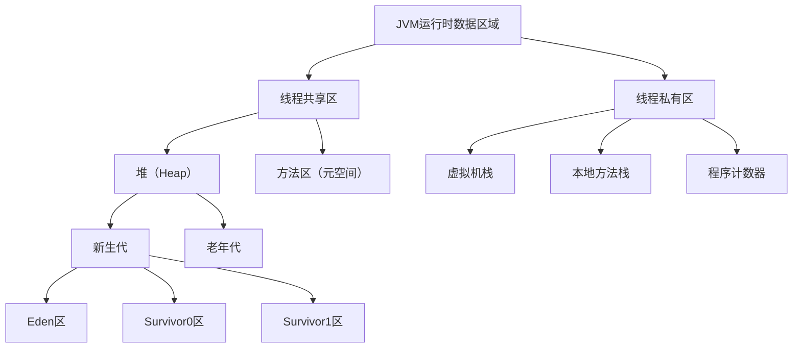

##### 1. 各区域功能说明
- **堆**：存储对象实例，GC主要区域，分为新生代（Eden:Survivor=8:1:1）和老年代
- **方法区（元空间）**：存储类信息、常量、静态变量，JDK1.8后替代永久代
- **虚拟机栈**：存储栈帧（局部变量表、操作数栈、动态链接、返回地址）
- **程序计数器**：记录当前线程执行的字节码指令地址，唯一不会OOM的区域

#### 类加载过程
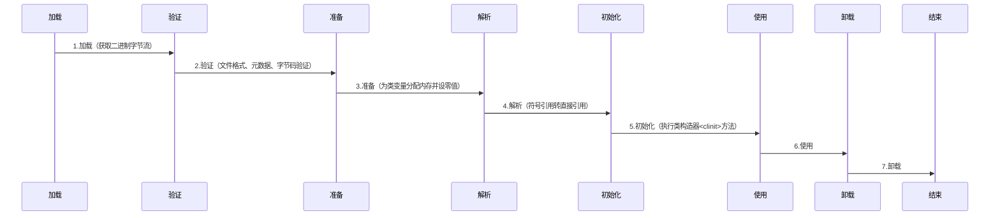

##### 双亲委派机制
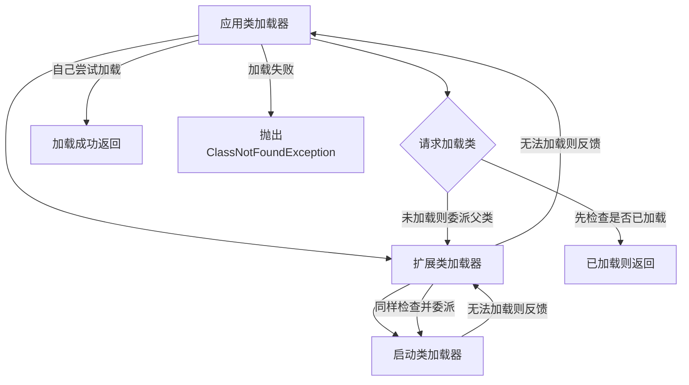

#### 垃圾回收
##### 1. 垃圾回收算法
| 算法类型     | 核心思想              | 适用场景              |
|--------------|-----------------------|-----------------------|
| 复制算法     | 内存分为两块，复制存活对象 | 新生代（存活对象少）  |
| 标记-清除算法 | 标记垃圾对象后统一清除 | 老年代（存活对象多）  |
| 标记-整理算法 | 标记后移动存活对象，清除垃圾 | 老年代                |
| 分代收集算法 | 结合以上算法，按代回收 | 整体JVM内存           |

##### 2. 垃圾收集器对比
| 收集器       | 特点                  | 适用场景              |
|--------------|-----------------------|-----------------------|
| Serial       | 单线程，STW时间长     | 客户端应用            |
| ParNew       | Serial多线程版本      | 新生代，配合CMS       |
| Parallel Scavenge | 关注吞吐量          | 后台计算任务          |
| CMS          | 并发收集，低延迟      | 互联网应用            |
| G1           | 分区收集，可控延迟    | 大堆内存（>4GB）      |
| ZGC          | 超低延迟（<10ms）     | 超大堆内存（TB级）    |

##### 3. JVM调优常用命令
```bash
# 查看Java进程
jps -l

# 查看JVM参数
jinfo -flags <pid>

# 查看GC统计信息
jstat -gcutil <pid> 1000 10

# 查看线程快照
jstack <pid> > thread.dump

# 生成堆转储文件
jmap -dump:format=b,file=heap.bin <pid>

# 分析堆转储文件（MAT工具）
# jhat heap.bin
```

### 三、多线程篇
#### 线程状态与切换
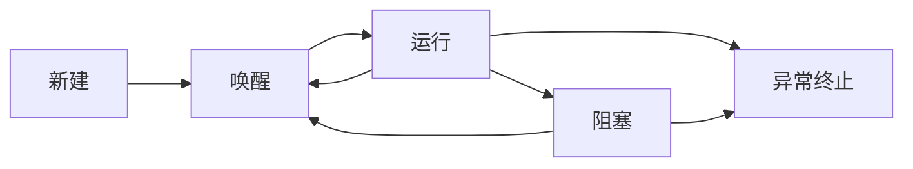

##### 线程状态说明
- **新建**：Thread对象创建但未调用start()
- **就绪**：调用start()后，等待CPU调度
- **运行**：CPU正在执行线程的run()方法
- **阻塞**：等待锁、IO操作、sleep等
- **死亡**：run()执行完毕或异常终止

#### 线程池
##### 1. 核心参数与执行流程
```java
public ThreadPoolExecutor(int corePoolSize, // 核心线程数
                          int maximumPoolSize, // 最大线程数
                          long keepAliveTime, // 空闲线程存活时间
                          TimeUnit unit, // 时间单位
                          BlockingQueue<Runnable> workQueue, // 任务队列
                          ThreadFactory threadFactory, // 线程工厂
                          RejectedExecutionHandler handler) // 拒绝策略
```

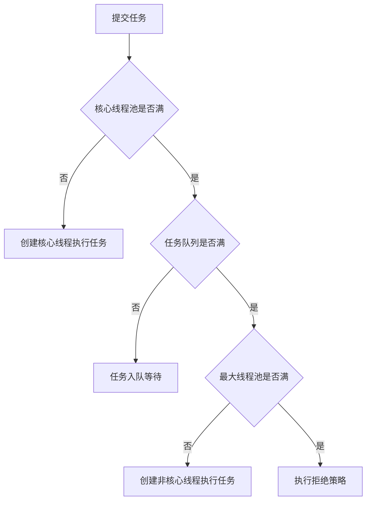

##### 2. 拒绝策略
| 策略类型     | 处理方式              |
|--------------|-----------------------|
| AbortPolicy  | 直接抛出异常          |
| CallerRunsPolicy | 调用者线程执行任务    |
| DiscardOldestPolicy | 丢弃最老任务，尝试入队 |
| DiscardPolicy | 静默丢弃任务          |

##### 3. 线程池实现（自定义）
```java
public class CustomThreadPool {
    private final BlockingQueue<Runnable> taskQueue;
    private final List<Worker> workers = new ArrayList<>();
    private int corePoolSize;
    private int maximumPoolSize;
    private long keepAliveTime;
    private TimeUnit unit;
    private RejectedExecutionHandler handler;

    public CustomThreadPool(int corePoolSize, int maximumPoolSize, 
                           long keepAliveTime, TimeUnit unit, 
                           int queueCapacity, RejectedExecutionHandler handler) {
        this.corePoolSize = corePoolSize;
        this.maximumPoolSize = maximumPoolSize;
        this.keepAliveTime = keepAliveTime;
        this.unit = unit;
        this.taskQueue = new ArrayBlockingQueue<>(queueCapacity);
        this.handler = handler;

        // 初始化核心线程
        for (int i = 0; i < corePoolSize; i++) {
            addWorker(null);
        }
    }

    public void execute(Runnable task) {
        if (task == null) throw new NullPointerException();
        try {
            boolean added = taskQueue.offer(task, 0, TimeUnit.SECONDS);
            if (!added) {
                // 队列满了，尝试创建非核心线程
                if (workers.size() < maximumPoolSize) {
                    addWorker(task);
                } else {
                    // 达到最大线程数，执行拒绝策略
                    handler.rejectedExecution(task, this);
                }
            }
        } catch (InterruptedException e) {
            Thread.currentThread().interrupt();
        }
    }

    private void addWorker(Runnable task) {
        Worker worker = new Worker(task);
        workers.add(worker);
        new Thread(worker).start();
    }

    private class Worker implements Runnable {
        private Runnable firstTask;

        public Worker(Runnable firstTask) {
            this.firstTask = firstTask;
        }

        @Override
        public void run() {
            Runnable task = firstTask;
            while (task != null || (task = getTask()) != null) {
                try {
                    task.run();
                } finally {
                    task = null;
                }
            }
            workers.remove(this);
        }

        private Runnable getTask() {
            try {
                return keepAliveTime > 0 ? 
                    taskQueue.poll(keepAliveTime, unit) : 
                    taskQueue.take();
            } catch (InterruptedException e) {
                return null;
            }
        }
    }

    // 拒绝策略接口
    public interface RejectedExecutionHandler {
        void rejectedExecution(Runnable r, CustomThreadPool executor);
    }

    // 测试
    public static void main(String[] args) {
        CustomThreadPool pool = new CustomThreadPool(2, 4, 1, TimeUnit.SECONDS, 
                                                   5, (r, e) -> {
            System.out.println("任务拒绝：" + r);
        });

        for (int i = 0; i < 10; i++) {
            int finalI = i;
            pool.execute(() -> {
                System.out.println("任务" + finalI + "执行，线程：" + Thread.currentThread().getName());
                try {
                    Thread.sleep(1000);
                } catch (InterruptedException e) {
                    e.printStackTrace();
                }
            });
        }
    }
}
```

#### 线程安全
##### 1. synchronized与ReentrantLock区别
| 特性         | synchronized          | ReentrantLock         |
|--------------|-----------------------|-----------------------|
| 实现方式     | JVM层面锁             | API层面锁             |
| 锁类型       | 非公平锁（可升级）    | 公平/非公平锁可选     |
| 释放方式     | 自动释放              | 手动释放（try-finally） |
| 功能扩展     | 基本锁功能            | 可中断、超时、条件变量 |
| 性能         | 高并发下略差          | 高并发下性能好         |

##### 2. volatile关键字
```java
public class VolatileExample {
    // volatile保证可见性和有序性，不保证原子性
    private volatile boolean flag = false;
    private int count = 0;

    public void setFlag() {
        flag = true; // 写操作，立即可见
    }

    public void doWork() {
        while (!flag) {
            // 循环等待flag变为true
        }
        System.out.println("执行任务");
    }

    // 原子性问题示例
    public void increment() {
        count++; // 非原子操作，volatile无法保证
    }
}
```

##### 3. ThreadLocal原理
```java
public class ThreadLocalExample {
    private static ThreadLocal<String> threadLocal = new ThreadLocal<>();

    public static void main(String[] args) {
        new Thread(() -> {
            threadLocal.set("线程1数据");
            System.out.println(Thread.currentThread().getName() + ":" + threadLocal.get());
            threadLocal.remove(); // 避免内存泄漏
        }, "线程1").start();

        new Thread(() -> {
            threadLocal.set("线程2数据");
            System.out.println(Thread.currentThread().getName() + ":" + threadLocal.get());
            threadLocal.remove();
        }, "线程2").start();
    }
}
```

### 四、MySQL篇
#### 事务特性（ACID）
- **原子性（Atomicity）**：事务要么全部执行，要么全部回滚
- **一致性（Consistency）**：事务执行前后数据完整性保持一致
- **隔离性（Isolation）**：并发事务之间相互隔离
- **持久性（Durability）**：事务提交后数据永久保存

#### 事务隔离级别
| 隔离级别     | 脏读                  | 不可重复读            | 幻读                  |
|--------------|-----------------------|-----------------------|-----------------------|
| 读未提交     | 允许                  | 允许                  | 允许                  |
| 读已提交     | 禁止                  | 允许                  | 允许                  |
| 可重复读     | 禁止                  | 禁止                  | 允许（InnoDB通过MVCC解决） |
| 串行化       | 禁止                  | 禁止                  | 禁止                  |

#### 索引
##### 1. 索引类型与结构
| 索引类型     | 结构特点              | 适用场景              |
|--------------|-----------------------|-----------------------|
| B+树索引     | 叶子节点存储数据/指针 | 范围查询、排序        |
| 哈希索引     | 哈希表结构            | 等值查询              |
| 聚簇索引     | 索引与数据存储在一起  | 主键查询              |
| 非聚簇索引   | 索引与数据分离        | 辅助查询              |

##### 2. 最左前缀原则
```sql
-- 创建联合索引：idx_name_age_score (name, age, score)
CREATE INDEX idx_name_age_score ON student(name, age, score);

-- 有效查询（遵循最左前缀）
SELECT * FROM student WHERE name = '张三';
SELECT * FROM student WHERE name = '张三' AND age = 20;
SELECT * FROM student WHERE name = '张三' AND age = 20 AND score = 90;

-- 无效查询（破坏最左前缀）
SELECT * FROM student WHERE age = 20;
SELECT * FROM student WHERE score = 90;
SELECT * FROM student WHERE name = '张三' AND score = 90;
```

#### SQL优化
##### 1. Explain分析
```sql
EXPLAIN SELECT * FROM student WHERE name = '张三' AND age > 20;
```
- **type**：访问类型（ALL<index<range<ref<eq_ref<system/const）
- **key**：实际使用的索引
- **rows**：预计扫描行数
- **Extra**：额外信息（Using index：覆盖索引，Using where：过滤条件）

##### 2. 优化技巧
```java
// 1. 避免全表扫描
// 坏：
String sql1 = "SELECT * FROM student WHERE age > 20"; // 无索引
// 好：
String sql2 = "SELECT id, name FROM student WHERE age > 20"; // 覆盖索引

// 2. 优化分页查询
// 坏：
String badPageSql = "SELECT * FROM student LIMIT 100000, 10";
// 好：
String goodPageSql = "SELECT * FROM student WHERE id > 100000 LIMIT 10";

// 3. 避免函数操作
// 坏：
String badFuncSql = "SELECT * FROM student WHERE SUBSTR(name, 1, 1) = '张'";
// 好：
String goodFuncSql = "SELECT * FROM student WHERE name LIKE '张%'";
```

### 五、Redis篇
#### 数据类型与应用场景
| 数据类型     | 底层结构              | 应用场景              |
|--------------|-----------------------|-----------------------|
| String       | SDS数组               | 缓存、计数器          |
| List         | 快速链表              | 消息队列、排行榜      |
| Hash         | 哈希表/压缩列表       | 存储对象              |
| Set          | 整数集合/哈希表       | 交集、并集、去重      |
| ZSet         | 跳跃表/压缩列表       | 排序、TopK查询        |

#### 持久化机制
##### 1. RDB与AOF对比
| 特性         | RDB                   | AOF                   |
|--------------|-----------------------|-----------------------|
| 存储方式     | 二进制快照            | 命令日志              |
| 持久化速度   | 快                    | 慢                    |
| 数据完整性   | 差（可能丢失数据）    | 好（可配置刷盘策略）  |
| 文件大小     | 小                    | 大                    |
| 恢复速度     | 快                    | 慢                    |

##### 2. 混合持久化（Redis4.0+）
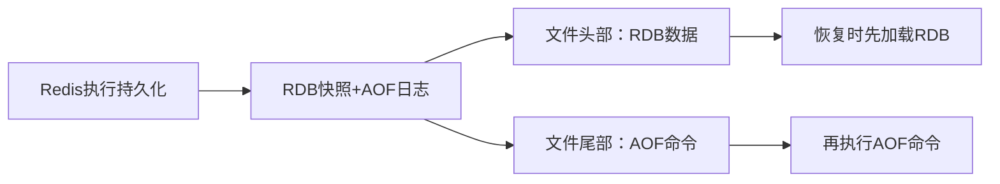

#### 缓存常见问题与解决方案
##### 1. 缓存雪崩
```java
// 解决方案：过期时间随机化
public void setCache(String key, Object value) {
    // 基础过期时间30分钟
    int baseExpire = 30 * 60;
    // 随机增加0-10分钟
    int randomExpire = new Random().nextInt(600);
    int expire = baseExpire + randomExpire;
    redisTemplate.opsForValue().set(key, value, expire, TimeUnit.SECONDS);
}
```

##### 2. 缓存穿透
```java
// 解决方案：布隆过滤器
public class BloomFilterExample {
    private BloomFilter<String> bloomFilter;

    public void initFilter(List<String> keys) {
        // 预计数据量100万，误判率0.01
        bloomFilter = BloomFilter.create(Funnels.stringFunnel(Charset.defaultCharset()), 
                                       1000000, 0.01);
        for (String key : keys) {
            bloomFilter.put(key);
        }
    }

    public boolean mightContain(String key) {
        return bloomFilter.mightContain(key);
    }

    // 缓存查询流程
    public Object getCache(String key) {
        // 布隆过滤器判断不存在，直接返回
        if (!mightContain(key)) {
            return null;
        }
        // 存在则查询缓存
        Object value = redisTemplate.opsForValue().get(key);
        if (value == null) {
            // 缓存穿透，设置空值缓存
            redisTemplate.opsForValue().set(key, null, 5, TimeUnit.MINUTES);
            return null;
        }
        return value;
    }
}
```

##### 3. 缓存击穿
```java
// 解决方案：互斥锁
public Object getCacheWithLock(String key) {
    // 1. 先查缓存
    Object value = redisTemplate.opsForValue().get(key);
    if (value != null) {
        return value;
    }

    // 2. 缓存不存在，获取锁
    String lockKey = "lock:" + key;
    boolean locked = redisTemplate.opsForValue().setIfAbsent(lockKey, "1", 3, TimeUnit.SECONDS);
    if (locked) {
        try {
            // 3. 再次检查缓存（防止并发）
            value = redisTemplate.opsForValue().get(key);
            if (value != null) {
                return value;
            }
            // 4. 查数据库
            value = db.query(key);
            // 5. 写入缓存
            redisTemplate.opsForValue().set(key, value, 30, TimeUnit.MINUTES);
        } finally {
            // 6. 释放锁
            redisTemplate.delete(lockKey);
        }
    } else {
        // 7. 未获取到锁，重试
        try {
            Thread.sleep(100);
        } catch (InterruptedException e) {
            Thread.currentThread().interrupt();
        }
        return getCacheWithLock(key);
    }
    return value;
}
```

### 六、Kafka篇
#### 核心架构
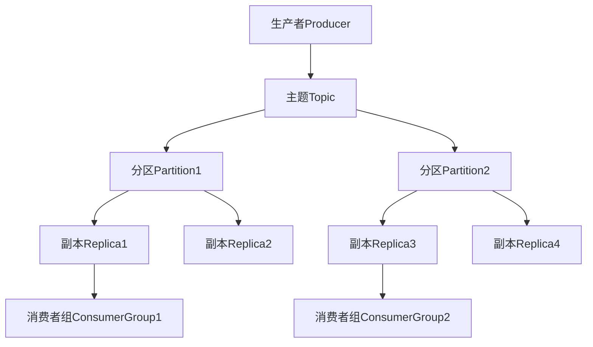

#### 生产消费流程
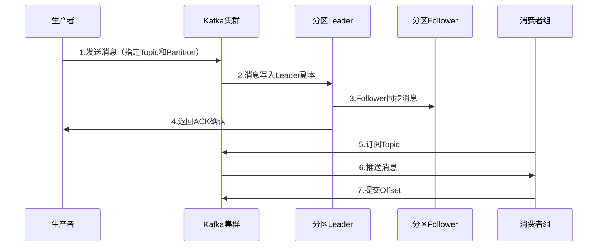

#### 关键问题解决方案
##### 1. 消息不丢失
```java
// 生产者配置
Properties producerProps = new Properties();
producerProps.put(ProducerConfig.ACKS_CONFIG, "all"); // 等待所有ISR副本确认
producerProps.put(ProducerConfig.RETRIES_CONFIG, 3); // 重试次数
producerProps.put(ProducerConfig.ENABLE_IDEMPOTENCE_CONFIG, true); // 幂等性

// 消费者配置
Properties consumerProps = new Properties();
consumerProps.put(ConsumerConfig.ENABLE_AUTO_COMMIT_CONFIG, false); // 关闭自动提交Offset

// 手动提交Offset
consumer.subscribe(Collections.singletonList("topic"));
while (true) {
    ConsumerRecords<String, String> records = consumer.poll(Duration.ofMillis(100));
    for (ConsumerRecord<String, String> record : records) {
        // 处理消息
        process(record);
    }
    // 消息处理完成后提交Offset
    consumer.commitSync();
}
```

##### 2. 消息重复消费
```java
// 解决方案：幂等性处理
public class IdempotentConsumer {
    // 存储已消费的消息ID
    private RedisTemplate<String, String> redisTemplate;
    private static final String PREFIX = "consumed:";

    public void consume(ConsumerRecord<String, String> record) {
        String messageId = record.headers().lastHeader("message-id").value().toString();
        String key = PREFIX + messageId;

        // 检查是否已消费
        Boolean exists = redisTemplate.hasKey(key);
        if (Boolean.TRUE.equals(exists)) {
            return; // 已消费，直接返回
        }

        try {
            // 处理消息
            process(record);
            // 标记为已消费
            redisTemplate.opsForValue().set(key, "1", 24, TimeUnit.HOURS);
        } catch (Exception e) {
            // 处理失败，不标记
            throw new RuntimeException("消息处理失败", e);
        }
    }

    private void process(ConsumerRecord<String, String> record) {
        // 业务处理逻辑
    }
}
```

### 七、Spring篇
#### IOC与DI
##### 1. IOC容器原理
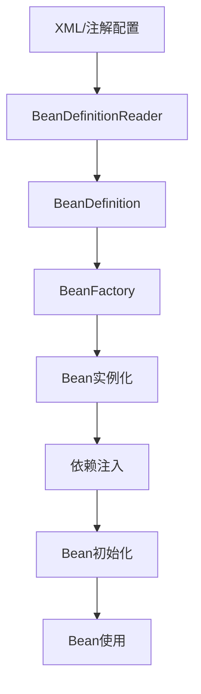

##### 2. 依赖注入方式
```java
// 1. 构造方法注入
@Component
public class UserService {
    private UserDao userDao;

    @Autowired
    public UserService(UserDao userDao) {
        this.userDao = userDao;
    }
}

// 2. Setter方法注入
@Component
public class UserService {
    private UserDao userDao;

    @Autowired
    public void setUserDao(UserDao userDao) {
        this.userDao = userDao;
    }
}

// 3. 字段注入
@Component
public class UserService {
    @Autowired
    private UserDao userDao;
}
```

#### AOP
##### 1. 核心概念
- **切面（Aspect）**：横切逻辑的封装
- **连接点（JoinPoint）**：程序执行的特定点
- **切入点（Pointcut）**：连接点的筛选条件
- **通知（Advice）**：切面的具体执行逻辑
- **目标对象（Target）**：被代理的对象

##### 2. AOP实现（注解方式）
```java
// 定义切面
@Aspect
@Component
public class LogAspect {
    // 切入点：所有service包下的方法
    @Pointcut("execution(* com.example.service.*.*(..))")
    public void servicePointcut() {}

    // 前置通知
    @Before("servicePointcut()")
    public void before(JoinPoint joinPoint) {
        String methodName = joinPoint.getSignature().getName();
        System.out.println("方法" + methodName + "开始执行");
    }

    // 后置通知
    @After("servicePointcut()")
    public void after(JoinPoint joinPoint) {
        String methodName = joinPoint.getSignature().getName();
        System.out.println("方法" + methodName + "执行结束");
    }

    // 返回通知
    @AfterReturning(pointcut = "servicePointcut()", returning = "result")
    public void afterReturning(JoinPoint joinPoint, Object result) {
        String methodName = joinPoint.getSignature().getName();
        System.out.println("方法" + methodName + "返回结果：" + result);
    }

    // 异常通知
    @AfterThrowing(pointcut = "servicePointcut()", throwing = "e")
    public void afterThrowing(JoinPoint joinPoint, Exception e) {
        String methodName = joinPoint.getSignature().getName();
        System.out.println("方法" + methodName + "抛出异常：" + e.getMessage());
    }

    // 环绕通知
    @Around("servicePointcut()")
    public Object around(ProceedingJoinPoint joinPoint) throws Throwable {
        long start = System.currentTimeMillis();
        try {
            // 执行目标方法
            Object result = joinPoint.proceed();
            long end = System.currentTimeMillis();
            System.out.println("方法执行耗时：" + (end - start) + "ms");
            return result;
        } catch (Throwable e) {
            long end = System.currentTimeMillis();
            System.out.println("方法执行异常，耗时：" + (end - start) + "ms");
            throw e;
        }
    }
}
```

#### Bean生命周期
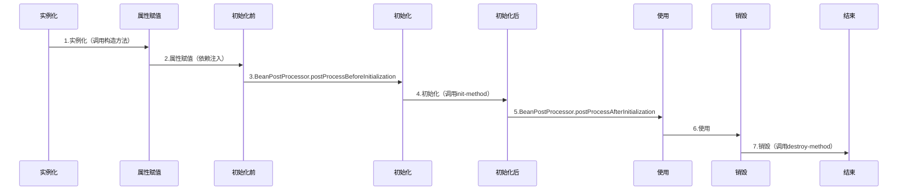

### 八、SpringCloud篇
#### 核心组件架构
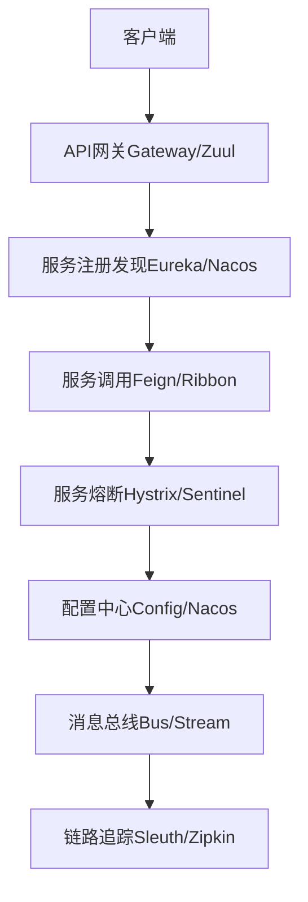

#### 服务注册与发现（Eureka）
```java
// 服务端配置
@SpringBootApplication
@EnableEurekaServer
public class EurekaServerApplication {
    public static void main(String[] args) {
        SpringApplication.run(EurekaServerApplication.class, args);
    }
}

// 客户端配置
@SpringBootApplication
@EnableEurekaClient
public class ServiceApplication {
    public static void main(String[] args) {
        SpringApplication.run(ServiceApplication.class, args);
    }
}

// 配置文件application.yml
eureka:
  client:
    serviceUrl:
      defaultZone: http://localhost:8761/eureka/
  instance:
    preferIpAddress: true
```

#### 服务调用（Feign）
```java
// 定义Feign客户端
@FeignClient(name = "user-service")
public interface UserFeignClient {
    @GetMapping("/user/{id}")
    User getUserById(@PathVariable("id") Long id);

    @PostMapping("/user")
    User createUser(@RequestBody User user);
}

// 服务消费者
@RestController
public class OrderController {
    @Autowired
    private UserFeignClient userFeignClient;

    @GetMapping("/order/{userId}")
    public Order getOrder(@PathVariable Long userId) {
        User user = userFeignClient.getUserById(userId);
        // 构建订单信息
        return new Order(user.getId(), "订单-" + user.getId(), user.getName());
    }
}
```

#### 服务熔断（Sentinel）
```java
@RestController
public class OrderController {
    @Autowired
    private UserFeignClient userFeignClient;

    @GetMapping("/order/{userId}")
    @SentinelResource(value = "getOrder", fallback = "getOrderFallback")
    public Order getOrder(@PathVariable Long userId) {
        if (userId == 0) {
            throw new IllegalArgumentException("用户ID不能为0");
        }
        User user = userFeignClient.getUserById(userId);
        return new Order(user.getId(), "订单-" + user.getId(), user.getName());
    }

    // 降级 fallback 方法
    public Order getOrderFallback(Long userId, Throwable e) {
        System.out.println("订单服务降级，原因：" + e.getMessage());
        return new Order(-1L, "默认订单", "默认用户");
    }
}
```

### 九、分布式篇
#### CAP理论
- **一致性（Consistency）**：所有节点数据一致
- **可用性（Availability）**：服务始终可用
- **分区容错性（Partition Tolerance）**：网络分区时系统仍能工作

**结论**：分布式系统必须满足P，只能在CP或AP之间选择
- CP：ZooKeeper、etcd
- AP：Eureka、Redis集群


#### 分布式事务
##### 1. 可靠消息最终一致性方案（完整流程）
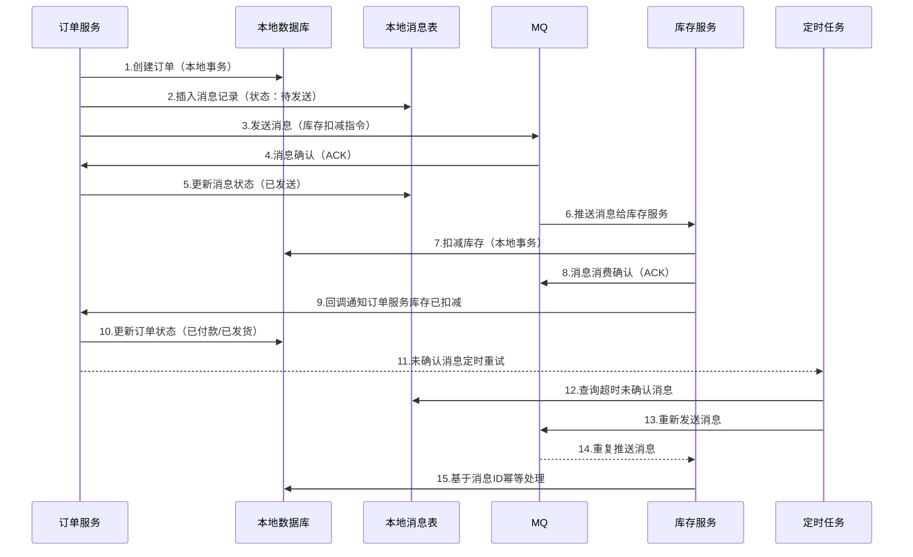

##### 2. TCC方案实现
```java
// 1. 业务接口（Try-Confirm-Cancel）
public interface InventoryTccService {
    /**
     * Try阶段：预留资源（冻结库存）
     */
    boolean tryFreezeInventory(Long productId, Integer count, String businessId);

    /**
     * Confirm阶段：确认扣减库存（Try成功后执行）
     */
    boolean confirmFreezeInventory(Long productId, Integer count, String businessId);

    /**
     * Cancel阶段：释放冻结库存（Try失败后执行）
     */
    boolean cancelFreezeInventory(Long productId, Integer count, String businessId);
}

// 2. 实现类
@Service
public class InventoryTccServiceImpl implements InventoryTccService {
    @Autowired
    private InventoryMapper inventoryMapper;

    @Override
    @Transactional
    public boolean tryFreezeInventory(Long productId, Integer count, String businessId) {
        // 1. 检查库存是否充足
        Inventory inventory = inventoryMapper.selectById(productId);
        if (inventory.getStock() < count) {
            return false;
        }
        // 2. 冻结库存（扣减可用库存，增加冻结库存）
        return inventoryMapper.freezeStock(productId, count, businessId) > 0;
    }

    @Override
    @Transactional
    public boolean confirmFreezeInventory(Long productId, Integer count, String businessId) {
        // 确认扣减：将冻结库存转为实际扣减
        return inventoryMapper.confirmFreezeStock(productId, count, businessId) > 0;
    }

    @Override
    @Transactional
    public boolean cancelFreezeInventory(Long productId, Integer count, String businessId) {
        // 取消冻结：释放冻结库存，恢复可用库存
        return inventoryMapper.cancelFreezeStock(productId, count, businessId) > 0;
    }
}

// 3. 事务协调器（简化版）
@Service
public class TccTransactionCoordinator {
    @Autowired
    private InventoryTccService inventoryTccService;

    public boolean executeTccTransaction(Long productId, Integer count) {
        String businessId = UUID.randomUUID().toString();
        boolean trySuccess = false;

        try {
            // 1. 执行Try阶段
            trySuccess = inventoryTccService.tryFreezeInventory(productId, count, businessId);
            if (!trySuccess) {
                throw new RuntimeException("库存冻结失败");
            }

            // 2. 执行核心业务（如创建订单）
            createOrder(productId, count, businessId);

            // 3. 执行Confirm阶段
            return inventoryTccService.confirmFreezeInventory(productId, count, businessId);
        } catch (Exception e) {
            // 4. 异常时执行Cancel阶段
            if (trySuccess) {
                inventoryTccService.cancelFreezeInventory(productId, count, businessId);
            }
            return false;
        }
    }

    private void createOrder(Long productId, Integer count, String businessId) {
        // 订单创建逻辑
    }
}
```

##### 3. Saga方案（长事务补偿）
```java
// 1. 定义Saga事件
public enum SagaEvent {
    ORDER_CREATED,        // 订单创建
    INVENTORY_DEDUCTED,   // 库存扣减
    PAYMENT_COMPLETED,    // 支付完成
    ORDER_CONFIRMED,      // 订单确认
    INVENTORY_ROLLED_BACK,// 库存回滚
    PAYMENT_ROLLED_BACK   // 支付回滚
}

// 2. Saga状态机
@Service
public class OrderSagaManager {
    @Autowired
    private InventoryService inventoryService;
    @Autowired
    private PaymentService paymentService;
    @Autowired
    private OrderService orderService;
    @Autowired
    private MQProducer mqProducer;

    // 正向流程
    public void processSaga(Order order) {
        try {
            // 1. 创建订单
            orderService.createOrder(order);
            mqProducer.sendEvent(SagaEvent.ORDER_CREATED, order.getOrderId());

            // 2. 扣减库存
            boolean inventorySuccess = inventoryService.deductStock(order.getProductId(), order.getCount());
            if (!inventorySuccess) {
                throw new RuntimeException("库存扣减失败");
            }
            mqProducer.sendEvent(SagaEvent.INVENTORY_DEDUCTED, order.getOrderId());

            // 3. 处理支付
            boolean paymentSuccess = paymentService.processPayment(order.getOrderId(), order.getAmount());
            if (!paymentSuccess) {
                throw new RuntimeException("支付处理失败");
            }
            mqProducer.sendEvent(SagaEvent.PAYMENT_COMPLETED, order.getOrderId());

            // 4. 确认订单
            orderService.confirmOrder(order.getOrderId());
            mqProducer.sendEvent(SagaEvent.ORDER_CONFIRMED, order.getOrderId());
        } catch (Exception e) {
            // 触发补偿流程
            rollbackSaga(order.getOrderId(), e.getMessage());
        }
    }

    // 补偿流程
    private void rollbackSaga(String orderId, String reason) {
        // 查询当前Saga执行状态
        SagaStatus status = orderService.getSagaStatus(orderId);

        // 按反向顺序补偿
        if (status == SagaStatus.PAYMENT_COMPLETED) {
            // 回滚支付
            paymentService.rollbackPayment(orderId);
            mqProducer.sendEvent(SagaEvent.PAYMENT_ROLLED_BACK, orderId);
        }
        if (status == SagaStatus.INVENTORY_DEDUCTED || status == SagaStatus.PAYMENT_ROLLED_BACK) {
            // 回滚库存
            inventoryService.rollbackStock(orderId);
            mqProducer.sendEvent(SagaEvent.INVENTORY_ROLLED_BACK, orderId);
        }
        // 回滚订单状态
        orderService.cancelOrder(orderId, reason);
    }
}
```

#### 分布式Session
##### 1. Redis实现分布式Session
```java
// 1. Session配置
@Configuration
@EnableRedisHttpSession(maxInactiveIntervalInSeconds = 1800) // 30分钟过期
public class RedisSessionConfig {
    @Bean
    public RedisHttpSessionConfiguration redisHttpSessionConfiguration() {
        return new RedisHttpSessionConfiguration();
    }

    @Bean
    public LettuceConnectionFactory connectionFactory() {
        return new LettuceConnectionFactory(new RedisStandaloneConfiguration("localhost", 6379));
    }
}

// 2. 登录接口（存储Session）
@RestController
public class LoginController {
    @Autowired
    private UserService userService;

    @PostMapping("/login")
    public Result login(@RequestBody LoginDTO loginDTO, HttpSession session) {
        // 验证用户名密码
        User user = userService.verifyUser(loginDTO.getUsername(), loginDTO.getPassword());
        if (user == null) {
            return Result.error("用户名或密码错误");
        }
        // 存储用户信息到Session
        session.setAttribute("loginUser", user);
        return Result.success("登录成功", session.getId());
    }

    @GetMapping("/user/info")
    public Result getUserInfo(HttpSession session) {
        // 从Session获取用户信息
        User user = (User) session.getAttribute("loginUser");
        if (user == null) {
            return Result.error("未登录");
        }
        return Result.success(user);
    }
}
```

##### 2. JWT实现无状态Session
```java
// 1. JWT工具类
public class JwtUtils {
    // 密钥（生产环境需存储在配置中心）
    private static final String SECRET = "your-secret-key";
    // 过期时间（2小时）
    private static final long EXPIRATION = 7200000;

    // 生成Token
    public static String generateToken(User user) {
        Map<String, Object> claims = new HashMap<>();
        claims.put("userId", user.getId());
        claims.put("username", user.getUsername());
        claims.put("role", user.getRole());

        return Jwts.builder()
                .setClaims(claims)
                .setExpiration(new Date(System.currentTimeMillis() + EXPIRATION))
                .signWith(SignatureAlgorithm.HS512, SECRET)
                .compact();
    }

    // 验证Token
    public static boolean validateToken(String token) {
        try {
            Jwts.parser().setSigningKey(SECRET).parseClaimsJws(token);
            return true;
        } catch (Exception e) {
            return false;
        }
    }

    // 从Token中获取用户信息
    public static Map<String, Object> getClaimsFromToken(String token) {
        return Jwts.parser()
                .setSigningKey(SECRET)
                .parseClaimsJws(token)
                .getBody();
    }
}

// 2. 登录与认证接口
@RestController
public class JwtLoginController {
    @Autowired
    private UserService userService;

    @PostMapping("/jwt/login")
    public Result jwtLogin(@RequestBody LoginDTO loginDTO) {
        User user = userService.verifyUser(loginDTO.getUsername(), loginDTO.getPassword());
        if (user == null) {
            return Result.error("用户名或密码错误");
        }
        // 生成JWT Token
        String token = JwtUtils.generateToken(user);
        return Result.success("登录成功", token);
    }

    // 需认证的接口
    @GetMapping("/jwt/user/info")
    public Result getUserInfo(@RequestHeader("Authorization") String token) {
        // 验证Token
        if (!token.startsWith("Bearer ") || !JwtUtils.validateToken(token.substring(7))) {
            return Result.error("Token无效或已过期");
        }
        // 获取用户信息
        Map<String, Object> claims = JwtUtils.getClaimsFromToken(token.substring(7));
        return Result.success(claims);
    }
}

// 3. 全局拦截器（验证Token）
@Component
public class JwtInterceptor implements HandlerInterceptor {
    @Override
    public boolean preHandle(HttpServletRequest request, HttpServletResponse response, Object handler) throws Exception {
        // 跳过登录接口
        if (request.getRequestURI().contains("/jwt/login")) {
            return true;
        }

        // 获取Authorization头
        String token = request.getHeader("Authorization");
        if (token == null || !token.startsWith("Bearer ") || !JwtUtils.validateToken(token.substring(7))) {
            response.setStatus(HttpServletResponse.SC_UNAUTHORIZED);
            response.getWriter().write("Unauthorized: Invalid Token");
            return false;
        }
        return true;
    }
}
```

## 下篇：高级技术与实战
### 一、ES篇
#### 概述与核心概念
##### 1. ES与关系型数据库对比
| 关系型数据库 | Elasticsearch | 说明                  |
|--------------|---------------|-----------------------|
| 数据库（Database） | 索引（Index） | 存储相似结构的数据集合 |
| 表（Table）   | 类型（Type）  | 已在ES7.x中移除       |
| 行（Row）     | 文档（Document） | 最小数据单元          |
| 列（Column）  | 字段（Field）  | 文档的属性            |
| 索引（Index）  | 倒排索引      | 用于快速检索          |

##### 2. 核心架构
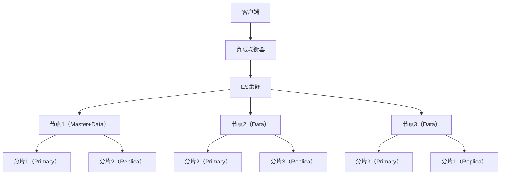

#### 索引与映射
##### 1. 创建索引与映射（DSL）
```json
// 创建索引
PUT /product_index
{
  "settings": {
    "number_of_shards": 3,    // 主分片数
    "number_of_replicas": 1   // 副本数
  },
  "mappings": {
    "properties": {
      "product_id": {
        "type": "long"
      },
      "product_name": {
        "type": "text",
        "analyzer": "ik_max_word",  // IK分词器（细粒度）
        "search_analyzer": "ik_smart", // 搜索时分词（粗粒度）
        "fields": {
          "keyword": {
            "type": "keyword"       // keyword类型（精确匹配）
          }
        }
      },
      "category": {
        "type": "keyword"
      },
      "price": {
        "type": "double"
      },
      "create_time": {
        "type": "date",
        "format": "yyyy-MM-dd HH:mm:ss"
      },
      "tags": {
        "type": "keyword"
      }
    }
  }
}
```

##### 2. Java API操作ES
```java
// 1. 配置ES客户端
@Configuration
public class ElasticsearchConfig {
    @Bean
    public RestHighLevelClient esClient() {
        ClientConfiguration clientConfiguration = ClientConfiguration.builder()
                .connectedTo("localhost:9200")
                .withConnectTimeout(Duration.ofSeconds(5))
                .withSocketTimeout(Duration.ofSeconds(3))
                .build();
        return RestClients.create(clientConfiguration).rest();
    }
}

// 2. 索引操作服务
@Service
public class EsIndexService {
    @Autowired
    private RestHighLevelClient esClient;

    // 创建索引
    public boolean createIndex(String indexName, String mappingJson) throws IOException {
        CreateIndexRequest request = new CreateIndexRequest(indexName);
        request.source(mappingJson, XContentType.JSON);
        CreateIndexResponse response = esClient.indices().create(request, RequestOptions.DEFAULT);
        return response.isAcknowledged();
    }

    // 删除索引
    public boolean deleteIndex(String indexName) throws IOException {
        DeleteIndexRequest request = new DeleteIndexRequest(indexName);
        AcknowledgedResponse response = esClient.indices().delete(request, RequestOptions.DEFAULT);
        return response.isAcknowledged();
    }

    // 检查索引是否存在
    public boolean existsIndex(String indexName) throws IOException {
        GetIndexRequest request = new GetIndexRequest(indexName);
        return esClient.indices().exists(request, RequestOptions.DEFAULT);
    }
}

// 3. 文档操作服务
@Service
public class EsDocumentService {
    @Autowired
    private RestHighLevelClient esClient;

    // 添加文档
    public boolean addDocument(String indexName, String id, Object document) throws IOException {
        IndexRequest request = new IndexRequest(indexName);
        if (id != null) {
            request.id(id);
        }
        request.source(new ObjectMapper().writeValueAsString(document), XContentType.JSON);
        IndexResponse response = esClient.index(request, RequestOptions.DEFAULT);
        return response.getResult() == DocWriteResponse.Result.CREATED;
    }

    // 获取文档
    public <T> T getDocument(String indexName, String id, Class<T> clazz) throws IOException {
        GetRequest request = new GetRequest(indexName, id);
        GetResponse response = esClient.get(request, RequestOptions.DEFAULT);
        if (response.isExists()) {
            return new ObjectMapper().readValue(response.getSourceAsString(), clazz);
        }
        return null;
    }

    // 批量添加文档
    public void bulkAddDocuments(String indexName, List<Object> documents) throws IOException {
        BulkRequest request = new BulkRequest();
        for (Object doc : documents) {
            IndexRequest indexRequest = new IndexRequest(indexName);
            indexRequest.source(new ObjectMapper().writeValueAsString(doc), XContentType.JSON);
            request.add(indexRequest);
        }
        esClient.bulk(request, RequestOptions.DEFAULT);
    }
}
```

#### 高级查询
##### 1. 复杂查询示例（DSL）
```json
// 组合查询：搜索分类为"手机"，价格在1000-5000元，名称包含"华为"或"小米"的商品
POST /product_index/_search
{
  "query": {
    "bool": {
      "must": [
        { "term": { "category": "手机" } },
        { "range": { "price": { "gte": 1000, "lte": 5000 } } }
      ],
      "should": [
        { "match": { "product_name": "华为" } },
        { "match": { "product_name": "小米" } }
      ],
      "minimum_should_match": 1
    }
  },
  "sort": [
    { "price": { "order": "asc" } },
    { "create_time": { "order": "desc" } }
  ],
  "from": 0,
  "size": 20,
  "highlight": {
    "fields": {
      "product_name": {
        "pre_tags": "<em>",
        "post_tags": "</em>"
      }
    }
  },
  "aggs": {
    "category_agg": {
      "terms": { "field": "category", "size": 10 },
      "aggs": {
        "avg_price": { "avg": { "field": "price" } }
      }
    }
  }
}
```

##### 2. Java API实现复杂查询
```java
@Service
public class EsSearchService {
    @Autowired
    private RestHighLevelClient esClient;

    public SearchResponse searchProducts(ProductSearchDTO searchDTO) throws IOException {
        SearchRequest request = new SearchRequest("product_index");
        SearchSourceBuilder sourceBuilder = new SearchSourceBuilder();

        // 构建布尔查询
        BoolQueryBuilder boolQuery = QueryBuilders.boolQuery();

        // 必须匹配：分类
        if (searchDTO.getCategory() != null) {
            boolQuery.must(QueryBuilders.termQuery("category", searchDTO.getCategory()));
        }

        // 必须匹配：价格范围
        if (searchDTO.getMinPrice() != null && searchDTO.getMaxPrice() != null) {
            boolQuery.must(QueryBuilders.rangeQuery("price")
                    .gte(searchDTO.getMinPrice())
                    .lte(searchDTO.getMaxPrice()));
        }

        // 应该匹配：商品名称关键词
        if (searchDTO.getKeywords() != null && !searchDTO.getKeywords().isEmpty()) {
            BoolQueryBuilder shouldQuery = QueryBuilders.boolQuery();
            for (String keyword : searchDTO.getKeywords().split(",")) {
                shouldQuery.should(QueryBuilders.matchQuery("product_name", keyword));
            }
            boolQuery.should(shouldQuery);
            boolQuery.minimumShouldMatch(1);
        }

        sourceBuilder.query(boolQuery);

        // 排序
        if (searchDTO.getSortField() != null) {
            SortOrder order = "desc".equalsIgnoreCase(searchDTO.getSortOrder()) ? SortOrder.DESC : SortOrder.ASC;
            sourceBuilder.sort(searchDTO.getSortField(), order);
        } else {
            // 默认按价格升序，创建时间降序
            sourceBuilder.sort("price", SortOrder.ASC);
            sourceBuilder.sort("create_time", SortOrder.DESC);
        }

        // 分页
        sourceBuilder.from((searchDTO.getPage() - 1) * searchDTO.getSize());
        sourceBuilder.size(searchDTO.getSize());

        // 高亮
        HighlightBuilder highlightBuilder = new HighlightBuilder();
        HighlightBuilder.Field nameHighlight = new HighlightBuilder.Field("product_name")
                .preTags("<em>")
                .postTags("</em>");
        highlightBuilder.field(nameHighlight);
        sourceBuilder.highlighter(highlightBuilder);

        // 聚合
        TermsAggregationBuilder categoryAgg = AggregationBuilders.terms("category_agg")
                .field("category")
                .size(10);
        AvgAggregationBuilder avgPriceAgg = AggregationBuilders.avg("avg_price")
                .field("price");
        categoryAgg.subAggregation(avgPriceAgg);
        sourceBuilder.aggregation(categoryAgg);

        request.source(sourceBuilder);
        return esClient.search(request, RequestOptions.DEFAULT);
    }
}
```

#### 性能优化
##### 1. 写入优化
```java
@Service
public class EsWriteOptimizationService {
    @Autowired
    private RestHighLevelClient esClient;

    // 批量写入优化
    public void bulkWriteWithOptimization(List<Object> documents) throws IOException {
        BulkRequest request = new BulkRequest();
        request.timeout(TimeValue.timeValueSeconds(30)); // 超时时间
        request.setRefreshPolicy(WriteRequest.RefreshPolicy.NONE); // 禁用实时刷新

        // 分批处理（每批1000条）
        int batchSize = 1000;
        int batches = (documents.size() + batchSize - 1) / batchSize;

        for (int i = 0; i < batches; i++) {
            int start = i * batchSize;
            int end = Math.min((i + 1) * batchSize, documents.size());
            List<Object> batchDocs = documents.subList(start, end);

            for (Object doc : batchDocs) {
                IndexRequest indexRequest = new IndexRequest("product_index");
                indexRequest.source(new ObjectMapper().writeValueAsString(doc), XContentType.JSON);
                request.add(indexRequest);
            }

            // 执行批量写入
            esClient.bulk(request, RequestOptions.DEFAULT);
            request.clear(); // 清空请求

            // 控制写入速率（避免压垮ES）
            Thread.sleep(500);
        }

        // 最后手动刷新索引
        esClient.indices().refresh(new RefreshRequest("product_index"), RequestOptions.DEFAULT);
    }
}
```

##### 2. 读取优化
```java
@Service
public class EsReadOptimizationService {
    @Autowired
    private RestHighLevelClient esClient;

    // 读取优化：使用过滤查询、覆盖索引、限制返回字段
    public SearchResponse optimizedSearch(ProductSearchDTO searchDTO) throws IOException {
        SearchRequest request = new SearchRequest("product_index");
        SearchSourceBuilder sourceBuilder = new SearchSourceBuilder();

        BoolQueryBuilder boolQuery = QueryBuilders.boolQuery();

        // 过滤条件（不参与评分，性能更高）
        if (searchDTO.getCategory() != null) {
            boolQuery.filter(QueryBuilders.termQuery("category", searchDTO.getCategory()));
        }
        if (searchDTO.getMinPrice() != null) {
            boolQuery.filter(QueryBuilders.rangeQuery("price").gte(searchDTO.getMinPrice()));
        }
        if (searchDTO.getMaxPrice() != null) {
            boolQuery.filter(QueryBuilders.rangeQuery("price").lte(searchDTO.getMaxPrice()));
        }

        // 查询条件（参与评分）
        if (searchDTO.getKeywords() != null) {
            boolQuery.must(QueryBuilders.matchQuery("product_name", searchDTO.getKeywords()));
        }

        sourceBuilder.query(boolQuery);

        // 限制返回字段（覆盖索引）
        sourceBuilder.fetchSource(new String[]{"product_id", "product_name", "price", "category"}, null);

        // 禁用排序（如果不需要）
        if (searchDTO.isDisableSort()) {
            sourceBuilder.sort("_score", SortOrder.DESC);
        }

        // 分页优化（避免深分页）
        if (searchDTO.getPage() > 100) {
            // 深分页使用scroll或者search_after
            sourceBuilder.searchAfter(new Object[]{searchDTO.getLastSortValue()});
            sourceBuilder.from(0);
        } else {
            sourceBuilder.from((searchDTO.getPage() - 1) * searchDTO.getSize());
        }

        request.source(sourceBuilder);
        return esClient.search(request, RequestOptions.DEFAULT);
    }
}
```

### 二、Docker&K8S篇
#### Docker核心概念与操作
##### 1. Docker核心组件
| 组件         | 说明                  |
|--------------|-----------------------|
| 镜像（Image） | 只读模板，用于创建容器  |
| 容器（Container） | 镜像的运行实例        |
| 仓库（Repository） | 存储镜像的仓库        |
|  Dockerfile  | 构建镜像的配置文件    |
|  Docker Compose | 多容器编排工具        |

##### 2. Dockerfile示例（SpringBoot应用）
```dockerfile
# 基础镜像（JDK11）
FROM openjdk:11-jre-slim

# 维护者信息
LABEL maintainer="your-name@example.com"

# 暴露端口
EXPOSE 8080

# 挂载卷（日志、配置文件）
VOLUME /tmp /logs /config

# 环境变量
ENV SPRING_PROFILES_ACTIVE=prod
ENV JAVA_OPTS="-Xms512m -Xmx1024m"

# 复制jar包到容器
COPY target/springboot-app-1.0.0.jar app.jar

# 入口命令
ENTRYPOINT ["sh", "-c", "java $JAVA_OPTS -jar /app.jar --spring.config.location=file:/config/application.yml"]
```

##### 3. Docker Compose编排（多容器应用）
```yaml
# docker-compose.yml
version: '3.8'

services:
  # SpringBoot应用
  app:
    build: .
    ports:
      - "8080:8080"
    depends_on:
      - mysql
      - redis
    environment:
      - SPRING_DATASOURCE_URL=jdbc:mysql://mysql:3306/testdb?useSSL=false&serverTimezone=UTC
      - SPRING_DATASOURCE_USERNAME=root
      - SPRING_DATASOURCE_PASSWORD=root123
      - SPRING_REDIS_HOST=redis
      - SPRING_REDIS_PORT=6379
    volumes:
      - ./logs:/logs
      - ./config:/config
    restart: always

  # MySQL数据库
  mysql:
    image: mysql:8.0
    ports:
      - "3306:3306"
    environment:
      - MYSQL_ROOT_PASSWORD=root123
      - MYSQL_DATABASE=testdb
    volumes:
      - mysql-data:/var/lib/mysql
      - ./sql:/docker-entrypoint-initdb.d
    restart: always
    command: --default-authentication-plugin=mysql_native_password

  # Redis缓存
  redis:
    image: redis:6.2-alpine
    ports:
      - "6379:6379"
    volumes:
      - redis-data:/data
    restart: always
    command: redis-server --appendonly yes

volumes:
  mysql-data:
  redis-data:
```

#### K8S核心概念与部署
##### 1. K8S核心组件架构
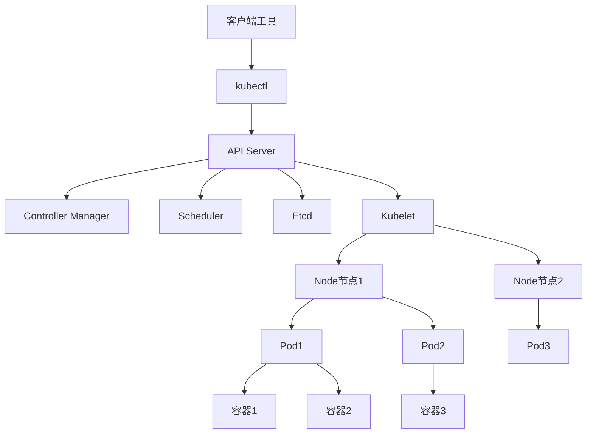

##### 2. 部署SpringBoot应用到K8S（YAML配置）
```yaml
# deployment.yaml
apiVersion: apps/v1
kind: Deployment
metadata:
  name: springboot-app
  namespace: default
spec:
  replicas: 3  # 3个副本
  selector:
    matchLabels:
      app: springboot-app
  template:
    metadata:
      labels:
        app: springboot-app
    spec:
      containers:
      - name: springboot-app
        image: your-registry/springboot-app:1.0.0
        ports:
        - containerPort: 8080
        resources:
          requests:
            cpu: "500m"
            memory: "512Mi"
          limits:
            cpu: "1000m"
            memory: "1Gi"
        env:
        - name: SPRING_PROFILES_ACTIVE
          value: "prod"
        - name: SPRING_DATASOURCE_URL
          valueFrom:
            configMapKeyRef:
              name: app-config
              key: db.url
        - name: SPRING_DATASOURCE_USERNAME
          valueFrom:
            secretKeyRef:
              name: app-secret
              key: db.username
        - name: SPRING_DATASOURCE_PASSWORD
          valueFrom:
            secretKeyRef:
              name: app-secret
              key: db.password
        livenessProbe:  # 存活探针
          httpGet:
            path: /actuator/health/liveness
            port: 8080
          initialDelaySeconds: 60
          periodSeconds: 10
        readinessProbe:  # 就绪探针
          httpGet:
            path: /actuator/health/readiness
            port: 8080
          initialDelaySeconds: 30
          periodSeconds: 5
        volumeMounts:
        - name: log-volume
          mountPath: /logs
      volumes:
      - name: log-volume
        emptyDir: {}

---
# service.yaml
apiVersion: v1
kind: Service
metadata:
  name: springboot-app-service
  namespace: default
spec:
  selector:
    app: springboot-app
  ports:
  - port: 80
    targetPort: 8080
  type: ClusterIP  # 集群内部访问

---
# ingress.yaml（外部访问）
apiVersion: networking.k8s.io/v1
kind: Ingress
metadata:
  name: springboot-app-ingress
  namespace: default
  annotations:
    nginx.ingress.kubernetes.io/rewrite-target: /
spec:
  rules:
  - host: app.example.com
    http:
      paths:
      - path: /
        pathType: Prefix
        backend:
          service:
            name: springboot-app-service
            port:
              number: 80

---
# configmap.yaml（配置文件）
apiVersion: v1
kind: ConfigMap
metadata:
  name: app-config
  namespace: default
data:
  db.url: jdbc:mysql://mysql-service:3306/testdb?useSSL=false&serverTimezone=UTC
  redis.host: redis-service
  redis.port: "6379"

---
# secret.yaml（敏感信息）
apiVersion: v1
kind: Secret
metadata:
  name: app-secret
  namespace: default
type: Opaque
data:
  db.username: cm9vdA==  # base64编码的root
  db.password: cm9vdDEyMw==  # base64编码的root123
```

### 三、Netty篇
#### 核心组件与架构
##### 1. Netty核心组件
| 组件         | 说明                  |
|--------------|-----------------------|
| Bootstrap/ServerBootstrap | 客户端/服务端启动器    |
| Channel      | 网络通道（读写操作）  |
| EventLoopGroup | 事件循环组（线程池）  |
| EventLoop    | 事件循环（处理Channel事件） |
| ChannelPipeline | 通道流水线（处理ChannelHandler） |
| ChannelHandler | 通道处理器（业务逻辑） |
| ByteBuf      | 数据缓冲区（替代ByteBuffer） |

##### 2. Netty服务端快速实现
```java
// 1. 服务端启动类
public class NettyServer {
    private final int port;

    public NettyServer(int port) {
        this.port = port;
    }

    public void start() throws InterruptedException {
        // 1. 创建事件循环组（BossGroup处理连接，WorkerGroup处理读写）
        EventLoopGroup bossGroup = new NioEventLoopGroup(1);
        EventLoopGroup workerGroup = new NioEventLoopGroup();

        try {
            // 2. 服务端启动器
            ServerBootstrap bootstrap = new ServerBootstrap();
            bootstrap.group(bossGroup, workerGroup)
                    .channel(NioServerSocketChannel.class) // 指定通道类型
                    .option(ChannelOption.SO_BACKLOG, 128) // 连接队列大小
                    .childOption(ChannelOption.SO_KEEPALIVE, true) // 保持连接
                    .childHandler(new ChannelInitializer<SocketChannel>() {
                        @Override
                        protected void initChannel(SocketChannel ch) throws Exception {
                            // 3. 添加处理器到流水线
                            ChannelPipeline pipeline = ch.pipeline();
                            // 解码器（解决粘包拆包）
                            pipeline.addLast(new LengthFieldBasedFrameDecoder(
                                    Integer.MAX_VALUE, 0, 4, 0, 4));
                            // 编码器
                            pipeline.addLast(new LengthFieldPrepender(4));
                            // 字符串编解码器
                            pipeline.addLast(new StringDecoder(CharsetUtil.UTF_8));
                            pipeline.addLast(new StringEncoder(CharsetUtil.UTF_8));
                            // 自定义业务处理器
                            pipeline.addLast(new ServerHandler());
                        }
                    });

            // 4. 绑定端口，同步等待启动完成
            ChannelFuture future = bootstrap.bind(port).sync();
            System.out.println("Netty服务端启动成功，端口：" + port);

            // 5. 等待通道关闭（阻塞）
            future.channel().closeFuture().sync();
        } finally {
            // 6. 优雅关闭事件循环组
            bossGroup.shutdownGracefully();
            workerGroup.shutdownGracefully();
        }
    }

    public static void main(String[] args) throws InterruptedException {
        new NettyServer(8888).start();
    }
}

// 2. 自定义业务处理器
public class ServerHandler extends ChannelInboundHandlerAdapter {
    // 客户端连接成功时触发
    @Override
    public void channelActive(ChannelHandlerContext ctx) throws Exception {
        System.out.println("客户端连接成功：" + ctx.channel().remoteAddress());
        // 发送欢迎消息
        ctx.writeAndFlush("欢迎连接Netty服务端！\n");
    }

    // 收到客户端消息时触发
    @Override
    public void channelRead(ChannelHandlerContext ctx, Object msg) throws Exception {
        String message = (String) msg;
        System.out.println("收到客户端消息：" + message);

        // 回复消息（模拟业务处理）
        String response = "服务端已收到：" + message + "\n";
        ctx.writeAndFlush(response);

        // 如果是"quit"，关闭连接
        if ("quit".equals(message.trim())) {
            ctx.close();
        }
    }

    // 异常时触发
    @Override
    public void exceptionCaught(ChannelHandlerContext ctx, Throwable cause) throws Exception {
        System.err.println("发生异常：" + cause.getMessage());
        ctx.close();
    }
}

// 3. 客户端实现
public class NettyClient {
    private final String host;
    private final int port;

    public NettyClient(String host, int port) {
        this.host = host;
        this.port = port;
    }

    public void connect() throws InterruptedException {
        // 1. 创建事件循环组
        EventLoopGroup group = new NioEventLoopGroup();

        try {
            // 2. 客户端启动器
            Bootstrap bootstrap = new Bootstrap();
            bootstrap.group(group)
                    .channel(NioSocketChannel.class)
                    .option(ChannelOption.TCP_NODELAY, true) // 禁用Nagle算法
                    .handler(new ChannelInitializer<SocketChannel>() {
                        @Override
                        protected void initChannel(SocketChannel ch) throws Exception {
                            ChannelPipeline pipeline = ch.pipeline();
                            // 与服务端保持一致的编解码器
                            pipeline.addLast(new LengthFieldBasedFrameDecoder(
                                    Integer.MAX_VALUE, 0, 4, 0, 4));
                            pipeline.addLast(new LengthFieldPrepender(4));
                            pipeline.addLast(new StringDecoder(CharsetUtil.UTF_8));
                            pipeline.addLast(new StringEncoder(CharsetUtil.UTF_8));
                            pipeline.addLast(new ClientHandler());
                        }
                    });

            // 3. 连接服务端
            ChannelFuture future = bootstrap.connect(host, port).sync();
            System.out.println("连接服务端成功：" + host + ":" + port);

            // 4. 从控制台输入消息并发送
            Channel channel = future.channel();
            Scanner scanner = new Scanner(System.in);
            while (scanner.hasNextLine()) {
                String message = scanner.nextLine();
                channel.writeAndFlush(message);
                if ("quit".equals(message.trim())) {
                    channel.close();
                    break;
                }
            }

            // 5. 等待通道关闭
            future.channel().closeFuture().sync();
        } finally {
            group.shutdownGracefully();
        }
    }

    public static void main(String[] args) throws InterruptedException {
        new NettyClient("localhost", 8888).connect();
    }
}

// 4. 客户端处理器
public class ClientHandler extends ChannelInboundHandlerAdapter {
    @Override
    public void channelRead(ChannelHandlerContext ctx, Object msg) throws Exception {
        String message = (String) msg;
        System.out.println("收到服务端消息：" + message);
    }

    @Override
    public void exceptionCaught(ChannelHandlerContext ctx, Throwable cause) throws Exception {
        System.err.println("发生异常：" + cause.getMessage());
        ctx.close();
    }
}
```

#### 粘包拆包解决方案
##### 1. 基于长度字段的编解码器（推荐）
```java
// 服务端流水线配置（已在上面示例中体现）
pipeline.addLast(new LengthFieldBasedFrameDecoder(
        Integer.MAX_VALUE,  // 最大帧长度
        0,                  // 长度字段偏移量
        4,                  // 长度字段占4字节
        0,                  // 长度字段调整值（不调整）
        4                   // 跳过长度字段
));
pipeline.addLast(new LengthFieldPrepender(4)); // 发送时添加长度字段
```

##### 2. 自定义协议实现
```java
// 1. 自定义消息实体
public class CustomMessage {
    private short magic; // 魔数（0x1234）
    private byte version; // 协议版本
    private byte type; // 消息类型（1-请求，2-响应）
    private int length; // 消息体长度
    private byte[] body; // 消息体

    // getter/setter
}

// 2. 自定义编码器
public class CustomMessageEncoder extends MessageToByteEncoder<CustomMessage> {
    @Override
    protected void encode(ChannelHandlerContext ctx, CustomMessage msg, ByteBuf out) throws Exception {
        // 写入魔数
        out.writeShort(msg.getMagic());
        // 写入版本
        out.writeByte(msg.getVersion());
        // 写入消息类型
        out.writeByte(msg.getType());
        // 写入消息体长度
        out.writeInt(msg.getLength());
        // 写入消息体
        if (msg.getLength() > 0) {
            out.writeBytes(msg.getBody());
        }
    }
}

// 3. 自定义解码器
public class CustomMessageDecoder extends ReplayingDecoder<Void> {
    @Override
    protected void decode(ChannelHandlerContext ctx, ByteBuf in, List<Object> out) throws Exception {
        // 读取魔数
        short magic = in.readShort();
        if (magic != 0x1234) {
            throw new IllegalArgumentException("非法魔数：" + magic);
        }

        // 读取版本
        byte version = in.readByte();
        // 读取消息类型
        byte type = in.readByte();
        // 读取消息体长度
        int length = in.readInt();
        // 读取消息体
        byte[] body = new byte[length];
        if (length > 0) {
            in.readBytes(body);
        }

        // 构建消息对象
        CustomMessage message = new CustomMessage();
        message.setMagic(magic);
        message.setVersion(version);
        message.setType(type);
        message.setLength(length);
        message.setBody(body);

        out.add(message);
    }
}

// 4. 配置流水线
pipeline.addLast(new CustomMessageDecoder());
pipeline.addLast(new CustomMessageEncoder());
pipeline.addLast(new BusinessHandler()); // 业务处理器
```

#### 高性能设计
##### 1. 零拷贝技术应用
```java
// 1. 文件传输（零拷贝）
public class FileTransferHandler extends ChannelInboundHandlerAdapter {
    @Override
    public void channelRead(ChannelHandlerContext ctx, Object msg) throws Exception {
        String filePath = (String) msg;
        File file = new File(filePath);
        if (!file.exists()) {
            ctx.writeAndFlush("文件不存在：" + filePath);
            return;
        }

        // 使用FileRegion实现零拷贝传输
        FileChannel fileChannel = new FileInputStream(file).getChannel();
        ChannelFuture future = ctx.writeAndFlush(new DefaultFileRegion(fileChannel, 0, file.length()));

        // 传输完成后关闭文件通道
        future.addListener((ChannelFutureListener) channelFuture -> {
            try {
                fileChannel.close();
                if (channelFuture.isSuccess()) {
                    ctx.writeAndFlush("文件传输完成！");
                } else {
                    ctx.writeAndFlush("文件传输失败：" + channelFuture.cause().getMessage());
                }
            } catch (IOException e) {
                e.printStackTrace();
            }
        });
    }
}

// 2. 内存池配置
public class NettyMemoryPoolConfig {
    public static void configure(ServerBootstrap bootstrap) {
        // 配置ByteBuf内存池
        bootstrap.option(ChannelOption.ALLOCATOR, PooledByteBufAllocator.DEFAULT)
                .childOption(ChannelOption.ALLOCATOR, PooledByteBufAllocator.DEFAULT);

        // 其他配置
        bootstrap.option(ChannelOption.SO_RCVBUF, 1024 * 1024) // 接收缓冲区大小
                .option(ChannelOption.SO_SNDBUF, 1024 * 1024) // 发送缓冲区大小
                .childOption(ChannelOption.TCP_NODELAY, true)
                .childOption(ChannelOption.SO_KEEPALIVE, true);
    }
}
```

### 四、算法与实战
#### 经典算法实现
##### 1. 手写LRU缓存
```java
public class LRUCache<K, V> {
    // 双向链表节点
    static class Node<K, V> {
        K key;
        V value;
        Node<K, V> prev;
        Node<K, V> next;

        public Node(K key, V value) {
            this.key = key;
            this.value = value;
        }
    }

    private final int capacity;
    private final Map<K, Node<K, V>> cache;
    private final Node<K, V> head; // 虚拟头节点
    private final Node<K, V> tail; // 虚拟尾节点

    public LRUCache(int capacity) {
        this.capacity = capacity;
        this.cache = new HashMap<>(capacity);
        // 初始化双向链表
        this.head = new Node<>(null, null);
        this.tail = new Node<>(null, null);
        head.next = tail;
        tail.prev = head;
    }

    // 获取元素
    public V get(K key) {
        Node<K, V> node = cache.get(key);
        if (node == null) {
            return null;
        }
        // 移动到链表头部（最近使用）
        moveToHead(node);
        return node.value;
    }

    // 放入元素
    public void put(K key, V value) {
        Node<K, V> node = cache.get(key);
        if (node != null) {
            // 已存在，更新值并移动到头部
            node.value = value;
            moveToHead(node);
            return;
        }

        // 不存在，创建新节点
        Node<K, V> newNode = new Node<>(key, value);
        cache.put(key, newNode);
        addToHead(newNode);

        // 超出容量，移除尾部节点（最久未使用）
        if (cache.size() > capacity) {
            Node<K, V> removeNode = removeTail();
            cache.remove(removeNode.key);
        }
    }

    // 移动节点到头部
    private void moveToHead(Node<K, V> node) {
        removeNode(node);
        addToHead(node);
    }

    // 移除节点
    private void removeNode(Node<K, V> node) {
        node.prev.next = node.next;
        node.next.prev = node.prev;
    }

    // 添加节点到头部
    private void addToHead(Node<K, V> node) {
        node.next = head.next;
        node.prev = head;
        head.next.prev = node;
        head.next = node;
    }

    // 移除尾部节点
    private Node<K, V> removeTail() {
        Node<K, V> node = tail.prev;
        removeNode(node);
        return node;
    }

    // 测试
    public static void main(String[] args) {
        LRUCache<Integer, String> cache = new LRUCache<>(3);
        cache.put(1, "A");
        cache.put(2, "B");
        cache.put(3, "C");
        System.out.println(cache.get(1)); // A（移动到头部）
        cache.put(4, "D"); // 移除2
        System.out.println(cache.get(2)); // null
        cache.put(3, "C1"); // 更新3
        System.out.println(cache.get(3)); // C1
    }
}
```

##### 2. 手写线程池
```java
// 续上：测试方法
public static void main(String[] args) {
    // 创建线程池
    CustomThreadPool pool = new CustomThreadPool(2, 4, 1, TimeUnit.SECONDS,
            5, Executors.defaultThreadFactory(), (r, e) -> {
        System.out.println("任务拒绝：" + r);
    });

    // 提交10个任务
    for (int i = 0; i < 10; i++) {
        int finalI = i;
        pool.execute(() -> {
            System.out.println("任务" + finalI + "执行，线程：" + Thread.currentThread().getName());
            try {
                Thread.sleep(1000); // 模拟任务执行耗时
            } catch (InterruptedException e) {
                Thread.currentThread().interrupt();
            }
        });
    }

    // 等待任务执行
    try {
        Thread.sleep(5000);
    } catch (InterruptedException e) {
        e.printStackTrace();
    }

    // 关闭线程池
    pool.shutdown();
}
}
```

##### 3. 手写快排
```java
public class QuickSort {
    // 递归实现
    public static void quickSort(int[] arr) {
        if (arr == null || arr.length <= 1) {
            return;
        }
        sort(arr, 0, arr.length - 1);
    }

    private static void sort(int[] arr, int left, int right) {
        if (left >= right) {
            return;
        }
        // 选择基准值（这里选中间元素）
        int pivotIndex = partition(arr, left, right);
        // 递归排序左半部分
        sort(arr, left, pivotIndex - 1);
        // 递归排序右半部分
        sort(arr, pivotIndex + 1, right);
    }

    private static int partition(int[] arr, int left, int right) {
        int pivot = arr[right]; // 基准值选最右侧元素
        int i = left - 1; // i是小于基准值区域的右边界

        for (int j = left; j < right; j++) {
            // 小于等于基准值的元素放入左侧区域
            if (arr[j] <= pivot) {
                i++;
                swap(arr, i, j);
            }
        }

        // 将基准值放到正确位置（i+1）
        swap(arr, i + 1, right);
        return i + 1;
    }

    private static void swap(int[] arr, int i, int j) {
        int temp = arr[i];
        arr[i] = arr[j];
        arr[j] = temp;
    }

    // 非递归实现（栈优化）
    public static void quickSortNonRecursive(int[] arr) {
        if (arr == null || arr.length <= 1) {
            return;
        }

        Stack<int[]> stack = new Stack<>();
        stack.push(new int[]{0, arr.length - 1});

        while (!stack.isEmpty()) {
            int[] range = stack.pop();
            int left = range[0];
            int right = range[1];

            int pivotIndex = partition(arr, left, right);

            // 左半部分入栈
            if (pivotIndex - 1 > left) {
                stack.push(new int[]{left, pivotIndex - 1});
            }

            // 右半部分入栈
            if (pivotIndex + 1 < right) {
                stack.push(new int[]{pivotIndex + 1, right});
            }
        }
    }

    // 测试
    public static void main(String[] args) {
        int[] arr = {5, 3, 8, 6, 2, 7, 1, 4};
        quickSort(arr);
        System.out.println(Arrays.toString(arr)); // [1, 2, 3, 4, 5, 6, 7, 8]

        int[] arr2 = {9, 5, 1, 3, 8, 4, 7, 2, 6};
        quickSortNonRecursive(arr2);
        System.out.println(Arrays.toString(arr2)); // [1, 2, 3, 4, 5, 6, 7, 8, 9]
    }
}
```

##### 4. 手写生产者-消费者模式
```java
public class ProducerConsumerPattern {
    // 产品队列（阻塞队列）
    private static final BlockingQueue<Integer> queue = new ArrayBlockingQueue<>(10);
    // 生产上限
    private static final int MAX_PRODUCT = 20;
    // 运行状态
    private static volatile boolean isRunning = true;

    // 生产者
    static class Producer implements Runnable {
        private final String name;

        public Producer(String name) {
            this.name = name;
        }

        @Override
        public void run() {
            try {
                int productId = 1;
                while (isRunning && productId <= MAX_PRODUCT) {
                    System.out.println("生产者" + name + "准备生产产品" + productId);
                    queue.put(productId); // 队列满则阻塞
                    System.out.println("生产者" + name + "生产产品" + productId + "成功，当前队列大小：" + queue.size());
                    productId++;
                    Thread.sleep(new Random().nextInt(500)); // 模拟生产耗时
                }
            } catch (InterruptedException e) {
                Thread.currentThread().interrupt();
            } finally {
                System.out.println("生产者" + name + "停止生产");
            }
        }
    }

    // 消费者
    static class Consumer implements Runnable {
        private final String name;

        public Consumer(String name) {
            this.name = name;
        }

        @Override
        public void run() {
            try {
                while (isRunning) {
                    Integer productId = queue.take(); // 队列空则阻塞
                    System.out.println("消费者" + name + "消费产品" + productId + "成功，当前队列大小：" + queue.size());
                    Thread.sleep(new Random().nextInt(1000)); // 模拟消费耗时
                }
            } catch (InterruptedException e) {
                Thread.currentThread().interrupt();
            } finally {
                System.out.println("消费者" + name + "停止消费");
            }
        }
    }

    public static void main(String[] args) throws InterruptedException {
        // 创建3个生产者
        new Thread(new Producer("P1")).start();
        new Thread(new Producer("P2")).start();
        new Thread(new Producer("P3")).start();

        // 创建2个消费者
        new Thread(new Consumer("C1")).start();
        new Thread(new Consumer("C2")).start();

        // 运行5秒后停止
        Thread.sleep(5000);
        isRunning = false;

        // 等待所有线程结束
        Thread.sleep(2000);
        System.out.println("生产消费结束");
    }
}
```

#### 实战算法场景
##### 1. 布隆过滤器（URL黑名单）
```java
public class BloomFilter {
    // 位数组大小（2^24 = 16777216）
    private static final int DEFAULT_SIZE = 1 << 24;
    // 哈希函数种子（3个不同的质数）
    private static final int[] SEEDS = {3, 5, 7};
    // 位数组
    private final BitSet bitSet;
    // 哈希函数数组
    private final HashFunction[] hashFunctions;

    // 哈希函数接口
    interface HashFunction {
        int hash(String value);
    }

    public BloomFilter() {
        this(DEFAULT_SIZE, SEEDS);
    }

    public BloomFilter(int size, int[] seeds) {
        bitSet = new BitSet(size);
        hashFunctions = new HashFunction[seeds.length];
        for (int i = 0; i < seeds.length; i++) {
            hashFunctions[i] = value -> {
                int hash = 0;
                for (char c : value.toCharArray()) {
                    hash = seeds[i] * hash + c;
                }
                return Math.abs(hash % size);
            };
        }
    }

    // 添加元素
    public void add(String value) {
        for (HashFunction hashFunction : hashFunctions) {
            int index = hashFunction.hash(value);
            bitSet.set(index);
        }
    }

    // 判断元素是否存在（可能误判，不会漏判）
    public boolean contains(String value) {
        for (HashFunction hashFunction : hashFunctions) {
            int index = hashFunction.hash(value);
            if (!bitSet.get(index)) {
                return false;
            }
        }
        return true;
    }

    // 测试：URL黑名单过滤
    public static void main(String[] args) {
        BloomFilter filter = new BloomFilter();
        // 添加黑名单URL
        String[] blacklistUrls = {
                "http://malicious.com/attack",
                "http://phishing.com/login",
                "http://virus.com/download"
        };
        for (String url : blacklistUrls) {
            filter.add(url);
        }

        // 测试判断
        String[] testUrls = {
                "http://malicious.com/attack", // 黑名单
                "http://baidu.com", // 正常
                "http://phishing.com/login", // 黑名单
                "http://github.com", // 正常
                "http://virus.com/download" // 黑名单
        };

        for (String url : testUrls) {
            if (filter.contains(url)) {
                System.out.println("URL[" + url + "] 命中黑名单，拒绝访问");
            } else {
                System.out.println("URL[" + url + "] 正常，允许访问");
            }
        }
    }
}
```

##### 2. 红包算法（公平分发）
```java
public class RedPacketAlgorithm {
    /**
     * 公平红包算法：每个人获得的金额在 [minMoney, maxMoney] 之间，总和等于totalMoney
     * @param totalMoney 总金额（单位：分）
     * @param count 红包个数
     * @param minMoney 最小金额（单位：分）
     * @param maxMoney 最大金额（单位：分）
     * @return 每个红包的金额列表
     */
    public static List<Integer> distributeRedPacket(int totalMoney, int count, int minMoney, int maxMoney) {
        List<Integer> result = new ArrayList<>(count);
        if (totalMoney < count * minMoney || totalMoney > count * maxMoney) {
            throw new IllegalArgumentException("金额分配无效");
        }

        Random random = new Random();
        int remainingMoney = totalMoney;
        int remainingCount = count;

        // 前count-1个红包随机分配
        for (int i = 0; i < count - 1; i++) {
            // 计算当前红包的最大可分配金额
            int max = remainingMoney - (remainingCount - 1) * minMoney;
            // 限制最大金额不超过设定的maxMoney
            max = Math.min(max, maxMoney);
            // 随机生成金额 [minMoney, max]
            int money = random.nextInt(max - minMoney + 1) + minMoney;
            result.add(money);
            remainingMoney -= money;
            remainingCount--;
        }

        // 最后一个红包分配剩余金额
        result.add(remainingMoney);
        // 打乱顺序（避免最后一个红包金额固定）
        Collections.shuffle(result);
        return result;
    }

    // 测试
    public static void main(String[] args) {
        // 测试1：100元分给10个人，每人最少1元，最多20元
        List<Integer> redPackets1 = distributeRedPacket(10000, 10, 100, 2000);
        System.out.println("100元红包分配（分）：" + redPackets1);
        System.out.println("总金额：" + redPackets1.stream().mapToInt(Integer::intValue).sum() + "分");

        // 测试2：50元分给5个人，每人最少5元，最多15元
        List<Integer> redPackets2 = distributeRedPacket(5000, 5, 500, 1500);
        System.out.println("50元红包分配（分）：" + redPackets2);
        System.out.println("总金额：" + redPackets2.stream().mapToInt(Integer::intValue).sum() + "分");
    }
}
```

### 五、实战项目
#### 一、秒杀项目
##### 1. 技术选型
| 分层         | 技术选型              | 说明                  |
|--------------|-----------------------|-----------------------|
| 前端         | Vue + ElementUI       | 页面展示与交互        |
| 网关         | Spring Cloud Gateway  | 路由转发、限流、认证  |
| 服务框架     | Spring Boot + Spring Cloud | 微服务架构支持      |
| 注册中心     | Nacos                 | 服务注册与发现        |
| 配置中心     | Nacos                 | 动态配置管理          |
| 限流熔断     | Sentinel              | 流量控制、服务保护    |
| 缓存         | Redis                 | 热点数据缓存、分布式锁 |
| 数据库       | MySQL + MyCat         | 主从复制、分库分表    |
| 消息队列     | Kafka                 | 异步处理、削峰填谷    |
| 分布式事务   | Seata                 | 保证数据一致性        |
| 日志收集     | ELK                   | 日志收集与分析        |
| 监控         | Prometheus + Grafana  | 系统监控与告警        |

##### 2. 核心问题解决方案
###### （1）超卖问题（分布式锁 + 库存预扣减）
```java
@Service
public class SeckillService {
    @Autowired
    private RedisTemplate<String, Object> redisTemplate;
    @Autowired
    private SeckillMapper seckillMapper;
    @Autowired
    private KafkaTemplate<String, String> kafkaTemplate;

    private static final String STOCK_KEY = "seckill:stock:";
    private static final String LOCK_KEY = "seckill:lock:";

    /**
     * 秒杀核心方法
     * @param seckillId 秒杀活动ID
     * @param userId 用户ID
     * @return 秒杀结果
     */
    public Result seckill(Long seckillId, Long userId) {
        // 1. 前置校验（用户是否已秒杀、活动是否有效）
        String userSeckillKey = "seckill:user:" + seckillId + ":" + userId;
        Boolean hasSeckilled = redisTemplate.hasKey(userSeckillKey);
        if (Boolean.TRUE.equals(hasSeckilled)) {
            return Result.error("您已参与过该秒杀活动");
        }

        // 2. 获取分布式锁
        String lockKey = LOCK_KEY + seckillId;
        Boolean locked = redisTemplate.opsForValue().setIfAbsent(lockKey, "1", 3, TimeUnit.SECONDS);
        if (Boolean.FALSE.equals(locked)) {
            return Result.error("秒杀过于火爆，请稍后重试");
        }

        try {
            // 3. 预扣减Redis库存
            String stockKey = STOCK_KEY + seckillId;
            Long stock = redisTemplate.opsForValue().decrement(stockKey);
            if (stock == null || stock < 0) {
                // 库存不足，回滚
                redisTemplate.opsForValue().increment(stockKey);
                return Result.error("秒杀已结束，库存不足");
            }

            // 4. 标记用户已秒杀
            redisTemplate.opsForValue().set(userSeckillKey, "1", 24, TimeUnit.HOURS);

            // 5. 发送消息到Kafka，异步创建订单
            SeckillMessage message = new SeckillMessage();
            message.setSeckillId(seckillId);
            message.setUserId(userId);
            kafkaTemplate.send("seckill_topic", JSON.toJSONString(message));

            return Result.success("秒杀成功，订单创建中");
        } finally {
            // 6. 释放锁
            redisTemplate.delete(lockKey);
        }
    }

    // Kafka消费者：异步创建订单
    @KafkaListener(topics = "seckill_topic")
    public void createOrder(String message) {
        SeckillMessage seckillMessage = JSON.parseObject(message, SeckillMessage.class);
        Long seckillId = seckillMessage.getSeckillId();
        Long userId = seckillMessage.getUserId();

        try {
            // 1. 查询秒杀活动信息
            SeckillActivity activity = seckillMapper.selectById(seckillId);
            if (activity == null || activity.getStatus() != 1) {
                // 活动无效，回滚库存
                redisTemplate.opsForValue().increment(STOCK_KEY + seckillId);
                return;
            }

            // 2. 创建订单（数据库事务）
            SeckillOrder order = new SeckillOrder();
            order.setOrderNo(generateOrderNo());
            order.setSeckillId(seckillId);
            order.setUserId(userId);
            order.setAmount(activity.getSeckillPrice());
            order.setStatus(0); // 待支付
            seckillMapper.insertOrder(order);

            // 3. 扣减数据库库存（最终一致性）
            seckillMapper.decrementStock(seckillId);
        } catch (Exception e) {
            // 异常回滚
            redisTemplate.opsForValue().increment(STOCK_KEY + seckillId);
            redisTemplate.delete("seckill:user:" + seckillId + ":" + userId);
            log.error("创建秒杀订单失败", e);
        }
    }

    // 生成订单号（雪花算法）
    private String generateOrderNo() {
        return IdUtil.getSnowflakeNextIdStr();
    }
}
```

###### （2）热点Key问题（本地缓存 + Redis集群）
```java
@Configuration
public class LocalCacheConfig {
    // 本地缓存（Caffeine）
    @Bean
    public Cache<Long, SeckillActivity> seckillLocalCache() {
        return Caffeine.newBuilder()
                .maximumSize(1000) // 最大缓存数量
                .expireAfterWrite(5, TimeUnit.MINUTES) // 5分钟过期
                .recordStats() // 统计缓存命中率
                .build();
    }
}

@Service
public class SeckillActivityService {
    @Autowired
    private Cache<Long, SeckillActivity> seckillLocalCache;
    @Autowired
    private SeckillMapper seckillMapper;
    @Autowired
    private RedisTemplate<String, Object> redisTemplate;

    private static final String ACTIVITY_KEY = "seckill:activity:";

    /**
     * 获取秒杀活动信息（本地缓存 -> Redis -> 数据库）
     */
    public SeckillActivity getSeckillActivity(Long seckillId) {
        // 1. 查本地缓存
        SeckillActivity activity = seckillLocalCache.getIfPresent(seckillId);
        if (activity != null) {
            return activity;
        }

        // 2. 查Redis
        String activityKey = ACTIVITY_KEY + seckillId;
        Object activityObj = redisTemplate.opsForValue().get(activityKey);
        if (activityObj != null) {
            activity = JSON.parseObject(activityObj.toString(), SeckillActivity.class);
            // 写入本地缓存
            seckillLocalCache.put(seckillId, activity);
            return activity;
        }

        // 3. 查数据库
        activity = seckillMapper.selectById(seckillId);
        if (activity != null) {
            // 写入Redis（设置1小时过期）
            redisTemplate.opsForValue().set(activityKey, JSON.toJSONString(activity), 1, TimeUnit.HOURS);
            // 写入本地缓存
            seckillLocalCache.put(seckillId, activity);
        }
        return activity;
    }
}
```

###### （3）防刷机制（限流 + 行为校验）
```java
// 1. 网关限流（Sentinel配置）
@Configuration
public class GatewaySentinelConfig {
    @PostConstruct
    public void initGatewayRules() {
        Set<GatewayFlowRule> rules = new HashSet<>();
        // 秒杀接口限流：1000 QPS
        GatewayFlowRule seckillRule = new GatewayFlowRule("seckill-service")
                .setResourceMode(SentinelGatewayConstants.RESOURCE_MODE_ROUTE_ID)
                .setCount(1000)
                .setGrade(RuleConstant.FLOW_GRADE_QPS)
                .setControlBehavior(RuleConstant.CONTROL_BEHAVIOR_DEFAULT);
        rules.add(seckillRule);
        GatewayRuleManager.loadRules(rules);
    }
}

// 2. 接口级限流（注解方式）
@RestController
@RequestMapping("/seckill")
public class SeckillController {
    @Autowired
    private SeckillService seckillService;

    /**
     * 秒杀接口（每用户每分钟最多5次请求）
     */
    @PostMapping("/doSeckill")
    @SentinelResource(value = "doSeckill", fallback = "seckillFallback")
    public Result doSeckill(@RequestBody SeckillDTO seckillDTO) {
        // 行为校验：检查用户IP是否在黑名单、是否频繁请求
        if (!validateUserBehavior(seckillDTO.getUserId(), seckillDTO.getIp())) {
            return Result.error("请求过于频繁，请稍后重试");
        }
        return seckillService.seckill(seckillDTO.getSeckillId(), seckillDTO.getUserId());
    }

    // 降级方法
    public Result seckillFallback(SeckillDTO seckillDTO, Throwable e) {
        log.error("秒杀接口降级", e);
        return Result.error("系统繁忙，请稍后重试");
    }

    // 用户行为校验
    private boolean validateUserBehavior(Long userId, String ip) {
        String key = "seckill:limit:" + userId + ":" + ip;
        RedisTemplate<String, Object> redisTemplate = SpringContextUtil.getBean(RedisTemplate.class);
        Long count = redisTemplate.opsForValue().increment(key, 1);
        if (count == 1) {
            redisTemplate.expire(key, 1, TimeUnit.MINUTES);
        }
        return count <= 5; // 每分钟最多5次请求
    }
}
```

#### 二、即时通信项目
##### 1. 架构设计
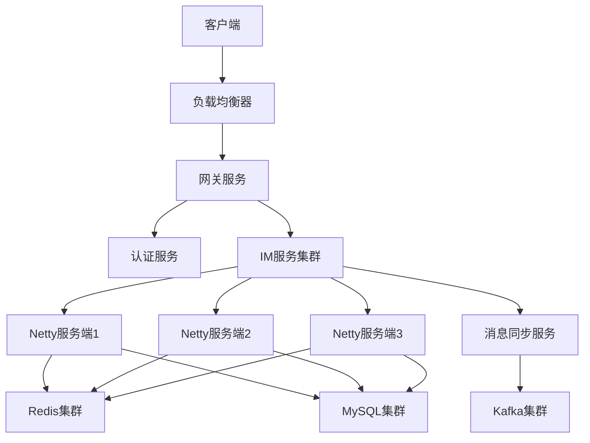

##### 2. 核心功能实现
###### （1）消息可靠传输（确认机制 + 重发）
```java
// Netty消息处理器
public class MessageHandler extends ChannelInboundHandlerAdapter {
    @Autowired
    private RedisTemplate<String, Object> redisTemplate;
    @Autowired
    private MessageService messageService;

    private static final String MESSAGE_ACK_KEY = "im:message:ack:";
    private static final String MESSAGE_RESEND_KEY = "im:message:resend:";

    // 收到客户端消息
    @Override
    public void channelRead(ChannelHandlerContext ctx, Object msg) throws Exception {
        MessageProtocol protocol = (MessageProtocol) msg;
        String messageId = protocol.getMessageId();
        Long userId = protocol.getUserId();
        String content = protocol.getContent();

        try {
            // 1. 存储消息（数据库 + Redis）
            Message message = new Message();
            message.setMessageId(messageId);
            message.setFromUserId(userId);
            message.setToUserId(protocol.getToUserId());
            message.setContent(content);
            message.setSendTime(new Date());
            message.setStatus(0); // 未送达
            messageService.saveMessage(message);

            // 2. 转发消息给接收方
            forwardMessage(protocol);

            // 3. 存储待确认消息（用于重发）
            redisTemplate.opsForValue().set(MESSAGE_RESEND_KEY + messageId, 
                    JSON.toJSONString(protocol), 30, TimeUnit.SECONDS);

            // 4. 回复发送方确认
            MessageAck ack = new MessageAck();
            ack.setMessageId(messageId);
            ack.setStatus(1); // 发送成功
            ctx.writeAndFlush(ack);
        } catch (Exception e) {
            // 发送失败，回复失败确认
            MessageAck ack = new MessageAck();
            ack.setMessageId(messageId);
            ack.setStatus(0); // 发送失败
            ctx.writeAndFlush(ack);
            log.error("消息处理失败", e);
        }
    }

    // 转发消息给接收方
    private void forwardMessage(MessageProtocol protocol) {
        Long toUserId = protocol.getToUserId();
        // 从Redis获取接收方的连接信息
        String userChannelKey = "im:user:channel:" + toUserId;
        String channelInfo = (String) redisTemplate.opsForValue().get(userChannelKey);
        if (channelInfo == null) {
            // 接收方不在线，存入离线消息
            redisTemplate.opsForList().leftPush("im:offline:" + toUserId, JSON.toJSONString(protocol));
            return;
        }

        // 在线，转发消息到对应的Netty服务端
        ChannelInfo info = JSON.parseObject(channelInfo, ChannelInfo.class);
        // 调用Netty服务端的API转发消息
        restTemplate.postForObject("http://im-server-" + info.getServerId() + "/forward", 
                protocol, String.class);
    }

    // 收到消息确认
    @Override
    public void userEventTriggered(ChannelHandlerContext ctx, Object evt) throws Exception {
        if (evt instanceof MessageAck) {
            MessageAck ack = (MessageAck) evt;
            if (ack.getStatus() == 1) {
                // 消息已送达，删除待重发消息
                redisTemplate.delete(MESSAGE_RESEND_KEY + ack.getMessageId());
                // 更新消息状态为已送达
                messageService.updateMessageStatus(ack.getMessageId(), 1);
            }
        }
    }
}

// 消息重发定时任务
@Component
@EnableScheduling
public class MessageResendTask {
    @Autowired
    private RedisTemplate<String, Object> redisTemplate;
    @Autowired
    private RestTemplate restTemplate;

    @Scheduled(fixedRate = 5000) // 每5秒执行一次
    public void resendMessage() {
        Set<String> keys = redisTemplate.keys(MESSAGE_RESEND_KEY + "*");
        if (keys == null || keys.isEmpty()) {
            return;
        }

        for (String key : keys) {
            String messageStr = (String) redisTemplate.opsForValue().get(key);
            if (messageStr == null) {
                redisTemplate.delete(key);
                continue;
            }

            MessageProtocol protocol = JSON.parseObject(messageStr, MessageProtocol.class);
            try {
                // 重发消息
                forwardMessage(protocol);
                // 延长过期时间
                redisTemplate.expire(key, 30, TimeUnit.SECONDS);
            } catch (Exception e) {
                log.error("消息重发失败", e);
                // 重发3次失败则放弃
                Long retryCount = redisTemplate.opsForValue().increment("im:message:retry:" + protocol.getMessageId(), 1);
                if (retryCount >= 3) {
                    redisTemplate.delete(key);
                    // 记录失败日志
                    messageService.updateMessageStatus(protocol.getMessageId(), 2); // 发送失败
                }
            }
        }
    }
}
```

### 六、架构设计
#### 4. 分布式事务架构设计
##### （1）基于Seata的AT模式实现
```java
// 1. 全局事务发起者（订单服务）
@Service
@GlobalTransactional(name = "create-order-transaction", rollbackFor = Exception.class)
public class OrderService {
    @Autowired
    private OrderMapper orderMapper;
    @Autowired
    private InventoryFeignClient inventoryFeignClient;
    @Autowired
    private PaymentFeignClient paymentFeignClient;

    public OrderDTO createOrder(OrderCreateDTO createDTO) {
        // 1. 创建订单（本地事务）
        Order order = new Order();
        order.setOrderNo(generateOrderNo());
        order.setUserId(createDTO.getUserId());
        order.setProductId(createDTO.getProductId());
        order.setQuantity(createDTO.getQuantity());
        order.setAmount(createDTO.getAmount());
        order.setStatus(0); // 待支付
        orderMapper.insert(order);

        try {
            // 2. 调用库存服务扣减库存（远程事务）
            Result<Boolean> inventoryResult = inventoryFeignClient.deductStock(
                    createDTO.getProductId(), createDTO.getQuantity());
            if (!inventoryResult.isSuccess() || !inventoryResult.getData()) {
                throw new RuntimeException("库存扣减失败");
            }

            // 3. 调用支付服务创建支付单（远程事务）
            PaymentCreateDTO paymentDTO = new PaymentCreateDTO();
            paymentDTO.setOrderNo(order.getOrderNo());
            paymentDTO.setUserId(createDTO.getUserId());
            paymentDTO.setAmount(createDTO.getAmount());
            Result<PaymentDTO> paymentResult = paymentFeignClient.createPayment(paymentDTO);
            if (!paymentResult.isSuccess() || paymentResult.getData() == null) {
                throw new RuntimeException("支付单创建失败");
            }

            // 4. 更新订单支付状态
            order.setPaymentNo(paymentResult.getData().getPaymentNo());
            order.setStatus(1); // 已支付
            orderMapper.updateById(order);

            OrderDTO result = new OrderDTO();
            BeanUtils.copyProperties(order, result);
            result.setPaymentNo(paymentResult.getData().getPaymentNo());
            return result;
        } catch (Exception e) {
            // 抛出异常触发全局回滚
            throw new RuntimeException("订单创建失败：" + e.getMessage());
        }
    }

    private String generateOrderNo() {
        return IdUtil.getSnowflakeNextIdStr();
    }
}

// 2. 库存服务（参与者）
@Service
public class InventoryService {
    @Autowired
    private InventoryMapper inventoryMapper;

    @Transactional
    public Boolean deductStock(Long productId, Integer quantity) {
        // 扣减库存
        int rows = inventoryMapper.deductStock(productId, quantity);
        return rows > 0;
    }

    // 回滚方法（Seata自动调用）
    public void undoDeductStock(Long productId, Integer quantity) {
        inventoryMapper.incrementStock(productId, quantity);
    }
}

// 3. 支付服务（参与者）
@Service
public class PaymentService {
    @Autowired
    private PaymentMapper paymentMapper;

    @Transactional
    public PaymentDTO createPayment(PaymentCreateDTO createDTO) {
        Payment payment = new PaymentDTO();
        payment.setPaymentNo(generatePaymentNo());
        payment.setOrderNo(createDTO.getOrderNo());
        payment.setUserId(createDTO.getUserId());
        payment.setAmount(createDTO.getAmount());
        payment.setStatus(0); // 待支付
        paymentMapper.insert(payment);

        PaymentDTO result = new PaymentDTO();
        BeanUtils.copyProperties(payment, result);
        return result;
    }

    // 回滚方法
    public void undoCreatePayment(String orderNo) {
        paymentMapper.deleteByOrderNo(orderNo);
    }

    private String generatePaymentNo() {
        return "PAY" + IdUtil.getSnowflakeNextIdStr();
    }
}
```

##### （2）Seata配置（application.yml）
```yaml
spring:
  cloud:
    alibaba:
      seata:
        tx-service-group: my_test_tx_group # 事务组名称
        service:
          vgroup-mapping:
            my_test_tx_group: default # 事务组与集群映射
          grouplist:
            default: 127.0.0.1:8091 # Seata Server地址
        registry:
          type: nacos # 注册中心类型
          nacos:
            server-addr: 127.0.0.1:8848
            namespace:
            group: SEATA_GROUP
            application: seata-server
```

#### 5. 微服务网关架构设计
##### （1）Spring Cloud Gateway核心配置
```yaml
spring:
  cloud:
    gateway:
      routes:
        # 订单服务路由
        - id: order-service
          uri: lb://order-service
          predicates:
            - Path=/api/order/**filters:
            - RewritePath=/api/order/(?<segment>.*), /$\{segment}
            - name: Sentinel
              args:
                resource: order-service
                fallbackUri: forward:/fallback/order
            - name: RequestRateLimiter
              args:
                redis-rate-limiter.replenishRate: 100 # 令牌桶填充速率
                redis-rate-limiter.burstCapacity: 200 # 令牌桶容量
                key-resolver: "#{@ipKeyResolver}" # 限流键解析器

        # 库存服务路由
        - id: inventory-service
          uri: lb://inventory-service
          predicates:
            - Path=/api/inventory/**filters:
            - RewritePath=/api/inventory/(?<segment>.*), /$\{segment}
            - name: Sentinel
              args:
                resource: inventory-service
                fallbackUri: forward:/fallback/inventory

        # 用户服务路由
        - id: user-service
          uri: lb://user-service
          predicates:
            - Path=/api/user/**filters:
            - RewritePath=/api/user/(?<segment>.*), /$\{segment}
            - name: AuthenticationFilter # 自定义认证过滤器
            - name: Sentinel
              args:
                resource: user-service
                fallbackUri: forward:/fallback/user

# Sentinel配置
spring:
  cloud:
    sentinel:
      transport:
        dashboard: 127.0.0.1:8080
      eager: true
      scg:
        fallback:
          mode: response
          response-status: 503
          response-body: '{"code":503,"message":"服务暂时不可用，请稍后重试"}'
```

##### （2）自定义认证过滤器
```java
@Component
public class AuthenticationFilter implements GlobalFilter, Ordered {
    @Autowired
    private RedisTemplate<String, Object> redisTemplate;

    @Override
    public Mono<Void> filter(ServerWebExchange exchange, GatewayFilterChain chain) {
        // 1. 跳过登录接口
        String path = exchange.getRequest().getPath().value();
        if (path.contains("/api/user/login") || path.contains("/api/user/register")) {
            return chain.filter(exchange);
        }

        // 2. 获取Token
        String token = exchange.getRequest().getHeaders().getFirst("Authorization");
        if (StringUtils.isEmpty(token) || !token.startsWith("Bearer ")) {
            return buildUnauthorizedResponse(exchange);
        }
        token = token.substring(7);

        // 3. 验证Token
        String userKey = "auth:token:" + token;
        Object userId = redisTemplate.opsForValue().get(userKey);
        if (userId == null) {
            return buildUnauthorizedResponse(exchange);
        }

        // 4. 延长Token有效期
        redisTemplate.expire(userKey, 2, TimeUnit.HOURS);

        // 5. 将用户ID存入请求头
        ServerHttpRequest request = exchange.getRequest().mutate()
                .header("X-User-ID", userId.toString())
                .build();
        return chain.filter(exchange.mutate().request(request).build());
    }

    // 构建未授权响应
    private Mono<Void> buildUnauthorizedResponse(ServerWebExchange exchange) {
        ServerHttpResponse response = exchange.getResponse();
        response.setStatusCode(HttpStatus.UNAUTHORIZED);
        response.getHeaders().add("Content-Type", "application/json;charset=UTF-8");

        String body = "{\"code\":401,\"message\":\"未授权或Token已过期\"}";
        DataBuffer buffer = response.bufferFactory().wrap(body.getBytes(StandardCharsets.UTF_8));
        return response.writeWith(Mono.just(buffer));
    }

    @Override
    public int getOrder() {
        return -100; // 过滤器执行顺序（负数优先执行）
    }
}
```

##### （3）限流键解析器
```java
@Component
public class IpKeyResolver implements KeyResolver {
    @Override
    public Mono<String> resolve(ServerWebExchange exchange) {
        // 基于IP限流
        String ip = exchange.getRequest().getRemoteAddress().getAddress().getHostAddress();
        return Mono.just(ip);
    }
}

// 基于用户ID限流
@Component
public class UserKeyResolver implements KeyResolver {
    @Override
    public Mono<String> resolve(ServerWebExchange exchange) {
        String userId = exchange.getRequest().getHeaders().getFirst("X-User-ID");
        return Mono.just(StringUtils.isEmpty(userId) ? "anonymous" : userId);
    }
}
```

### 七、领域模型落地
#### 1. 领域驱动设计（DDD）核心概念
| 概念         | 说明                  | 示例                  |
|--------------|-----------------------|-----------------------|
| 领域（Domain） | 业务领域              | 电商领域、金融领域    |
| 子域（Subdomain） | 领域的细分            | 订单子域、库存子域    |
| 限界上下文（Bounded Context） | 领域的边界划分      | 订单上下文、支付上下文 |
| 实体（Entity） | 具有唯一标识的领域对象 | 订单、用户            |
| 值对象（Value Object） | 无唯一标识的领域对象 | 地址、金额            |
| 聚合（Aggregate） | 实体和值对象的集合    | 订单聚合（订单+订单项） |
| 聚合根（Aggregate Root） | 聚合的入口点          | 订单（聚合根）        |
| 领域服务（Domain Service） | 领域内的业务逻辑      | 订单创建服务          |
| 领域事件（Domain Event） | 领域内的状态变更事件  | 订单支付成功事件      |

#### 2. 微服务与DDD映射关系
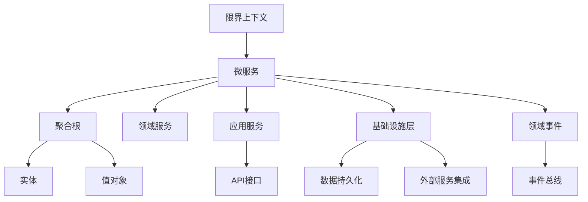

#### 3. 订单领域DDD落地示例
##### （1）领域模型设计
```java
// 1. 值对象：金额
@Value
public class Money {
    BigDecimal amount;
    String currency;

    // 金额加法
    public Money add(Money other) {
        if (!this.currency.equals(other.currency)) {
            throw new IllegalArgumentException("货币类型不一致");
        }
        return new Money(this.amount.add(other.amount), this.currency);
    }

    // 金额减法
    public Money subtract(Money other) {
        if (!this.currency.equals(other.currency)) {
            throw new IllegalArgumentException("货币类型不一致");
        }
        return new Money(this.amount.subtract(other.amount), this.currency);
    }

    // 工厂方法
    public static Money of(BigDecimal amount, String currency) {
        if (amount.compareTo(BigDecimal.ZERO) < 0) {
            throw new IllegalArgumentException("金额不能为负数");
        }
        return new Money(amount, currency);
    }
}

// 2. 值对象：地址
@Value
public class Address {
    String province;
    String city;
    String district;
    String detail;
    String zipCode;
    String phone;

    // 验证地址有效性
    public boolean isValid() {
        return StringUtils.isNotBlank(province) &&
                StringUtils.isNotBlank(city) &&
                StringUtils.isNotBlank(detail) &&
                StringUtils.isNotBlank(phone);
    }
}

// 3. 实体：订单项
@Entity
@Table(name = "order_item")
@Data
public class OrderItem {
    @Id
    @GeneratedValue(strategy = GenerationType.IDENTITY)
    private Long id;

    private Long productId;
    private String productName;
    private Integer quantity;
    private BigDecimal unitPrice;
    private BigDecimal totalPrice;

    // 计算订单项总价
    public void calculateTotalPrice() {
        this.totalPrice = this.unitPrice.multiply(new BigDecimal(this.quantity));
    }
}

// 4. 聚合根：订单
@Entity
@Table(name = "orders")
@Data
public class Order {
    @Id
    private String orderNo; // 聚合根唯一标识

    private Long userId;
    private String status; // 订单状态：PENDING-待支付、PAID-已支付、SHIPPED-已发货、COMPLETED-已完成、CANCELLED-已取消

    @Embedded
    private Address shippingAddress; // 配送地址（值对象）

    @OneToMany(cascade = CascadeType.ALL, mappedBy = "order")
    private List<OrderItem> orderItems = new ArrayList<>();

    private BigDecimal totalAmount;
    private Date createTime;
    private Date payTime;
    private Date shipTime;
    private Date completeTime;

    // 领域行为：添加订单项
    public void addOrderItem(OrderItem item) {
        item.calculateTotalPrice();
        this.orderItems.add(item);
        // 更新订单总价
        this.totalAmount = this.orderItems.stream()
                .map(OrderItem::getTotalPrice)
                .reduce(BigDecimal.ZERO, BigDecimal::add);
    }

    // 领域行为：支付订单
    public void pay(String paymentNo) {
        if (!"PENDING".equals(this.status)) {
            throw new IllegalStateException("只有待支付订单可以支付");
        }
        this.status = "PAID";
        this.payTime = new Date();
        // 发布订单支付成功事件
        DomainEventPublisher.publish(new OrderPaidEvent(this.orderNo, this.userId, this.totalAmount));
    }

    // 领域行为：取消订单
    public void cancel() {
        if (!"PENDING".equals(this.status)) {
            throw new IllegalStateException("只有待支付订单可以取消");
        }
        this.status = "CANCELLED";
        // 发布订单取消事件
        DomainEventPublisher.publish(new OrderCancelledEvent(this.orderNo, this.userId));
    }

    // 领域行为：发货
    public void ship(String logisticsNo) {
        if (!"PAID".equals(this.status)) {
            throw new IllegalStateException("只有已支付订单可以发货");
        }
        this.status = "SHIPPED";
        this.shipTime = new Date();
        // 发布订单发货事件
        DomainEventPublisher.publish(new OrderShippedEvent(this.orderNo, logisticsNo));
    }

    // 领域行为：完成订单
    public void complete() {
        if (!"SHIPPED".equals(this.status)) {
            throw new IllegalStateException("只有已发货订单可以完成");
        }
        this.status = "COMPLETED";
        this.completeTime = new Date();
        // 发布订单完成事件
        DomainEventPublisher.publish(new OrderCompletedEvent(this.orderNo));
    }
}

// 5. 领域事件
public class OrderPaidEvent {
    private String orderNo;
    private Long userId;
    private BigDecimal amount;
    private Date eventTime;

    public OrderPaidEvent(String orderNo, Long userId, BigDecimal amount) {
        this.orderNo = orderNo;
        this.userId = userId;
        this.amount = amount;
        this.eventTime = new Date();
    }

    // getter
}

// 6. 领域事件发布器
@Component
public class DomainEventPublisher {
    @Autowired
    private KafkaTemplate<String, String> kafkaTemplate;

    public static DomainEventPublisher INSTANCE;

    @PostConstruct
    public void init() {
        INSTANCE = this;
    }

    public void publish(Object event) {
        try {
            String topic = event.getClass().getSimpleName();
            String eventJson = JSON.toJSONString(event);
            kafkaTemplate.send(topic, eventJson);
            log.info("发布领域事件：{}，内容：{}", topic, eventJson);
        } catch (Exception e) {
            log.error("发布领域事件失败", e);
        }
    }
}
```

##### （2）领域服务
```java
@Service
public class OrderDomainService {
    @Autowired
    private OrderRepository orderRepository;
    @Autowired
    private ProductDomainService productDomainService;

    /**
     * 创建订单（领域核心逻辑）
     */
    public Order createOrder(Long userId, List<OrderItemDTO> itemDTOs, Address shippingAddress) {
        // 1. 验证地址有效性
        if (!shippingAddress.isValid()) {
            throw new IllegalArgumentException("无效的配送地址");
        }

        // 2. 验证商品库存并锁定
        for (OrderItemDTO itemDTO : itemDTOs) {
            boolean lockSuccess = productDomainService.lockStock(itemDTO.getProductId(), itemDTO.getQuantity());
            if (!lockSuccess) {
                throw new IllegalStateException("商品" + itemDTO.getProductName() + "库存不足");
            }
        }

        // 3. 创建订单
        Order order = new Order();
        order.setOrderNo(generateOrderNo());
        order.setUserId(userId);
        order.setStatus("PENDING");
        order.setShippingAddress(shippingAddress);
        order.setCreateTime(new Date());
        order.setTotalAmount(BigDecimal.ZERO);

        // 4. 添加订单项
        for (OrderItemDTO itemDTO : itemDTOs) {
            OrderItem item = new OrderItem();
            item.setProductId(itemDTO.getProductId());
            item.setProductName(itemDTO.getProductName());
            item.setQuantity(itemDTO.getQuantity());
            item.setUnitPrice(itemDTO.getUnitPrice());
            item.calculateTotalPrice();
            order.addOrderItem(item);
        }

        // 5. 保存订单
        return orderRepository.save(order);
    }

    private String generateOrderNo() {
        return "ORDER" + IdUtil.getSnowflakeNextIdStr();
    }
}
```

##### （3）应用服务
```java
@Service
public class OrderApplicationService {
    @Autowired
    private OrderDomainService orderDomainService;
    @Autowired
    private OrderRepository orderRepository;
    @Autowired
    private PaymentFeignClient paymentFeignClient;

    /**
     * 应用层创建订单接口
     */
    @Transactional
    public OrderDTO createOrder(OrderCreateDTO createDTO) {
        // 1. 转换DTO为领域对象
        List<OrderItemDTO> itemDTOs = createDTO.getItemDTOs();
        Address shippingAddress = new Address(
                createDTO.getProvince(),
                createDTO.getCity(),
                createDTO.getDistrict(),
                createDTO.getDetail(),
                createDTO.getZipCode(),
                createDTO.getPhone()
        );

        // 2. 调用领域服务创建订单
        Order order = orderDomainService.createOrder(createDTO.getUserId(), itemDTOs, shippingAddress);

        // 3. 调用支付服务创建支付单
        PaymentCreateDTO paymentDTO = new PaymentCreateDTO();
        paymentDTO.setOrderNo(order.getOrderNo());
        paymentDTO.setUserId(createDTO.getUserId());
        paymentDTO.setAmount(order.getTotalAmount());
        Result<PaymentDTO> paymentResult = paymentFeignClient.createPayment(paymentDTO);
        if (!paymentResult.isSuccess() || paymentResult.getData() == null) {
            throw new RuntimeException("创建支付单失败");
        }

        // 4. 转换领域对象为DTO返回
        OrderDTO result = new OrderDTO();
        BeanUtils.copyProperties(order, result);
        result.setPaymentNo(paymentResult.getData().getPaymentNo());
        result.setPaymentUrl(paymentResult.getData().getPaymentUrl());

        return result;
    }

    /**
     * 订单支付回调处理
     */
    @Transactional
    public void handlePaymentCallback(PaymentCallbackDTO callbackDTO) {
        // 1. 查询订单
        Order order = orderRepository.findByOrderNo(callbackDTO.getOrderNo())
                .orElseThrow(() -> new IllegalArgumentException("订单不存在"));

        // 2. 调用领域行为支付订单
        order.pay(callbackDTO.getPaymentNo());

        // 3. 保存订单
        orderRepository.save(order);
    }
}
```

##### （4）仓储层
```java
// 仓储接口
public interface OrderRepository {
    Order save(Order order);

    Optional<Order> findByOrderNo(String orderNo);

    List<Order> findByUserId(Long userId);

    void deleteByOrderNo(String orderNo);
}

// 仓储实现
@Repository
public class OrderRepositoryImpl implements OrderRepository {
    @Autowired
    private OrderJpaRepository jpaRepository;

    @Override
    public Order save(Order order) {
        return jpaRepository.save(order);
    }

    @Override
    public Optional<Order> findByOrderNo(String orderNo) {
        return jpaRepository.findByOrderNo(orderNo);
    }

    @Override
    public List<Order> findByUserId(Long userId) {
        return jpaRepository.findByUserId(userId);
    }

    @Override
    public void deleteByOrderNo(String orderNo) {
        jpaRepository.deleteByOrderNo(orderNo);
    }
}

// JPA接口
public interface OrderJpaRepository extends JpaRepository<Order, String> {
    Optional<Order> findByOrderNo(String orderNo);

    List<Order> findByUserId(Long userId);

    void deleteByOrderNo(String orderNo);
}
```

##### （5）API接口层
```java
@RestController
@RequestMapping("/api/orders")
public class OrderController {
    @Autowired
    private OrderApplicationService orderApplicationService;

    /**
     * 创建订单
     */
    @PostMapping
    public Result<OrderDTO> createOrder(@RequestBody @Valid OrderCreateDTO createDTO) {
        OrderDTO orderDTO = orderApplicationService.createOrder(createDTO);
        return Result.success(orderDTO);
    }

    /**
     * 查询订单详情
     */
    @GetMapping("/{orderNo}")
    public Result<OrderDTO> getOrderDetail(@PathVariable String orderNo) {
        OrderDTO orderDTO = orderApplicationService.getOrderDetail(orderNo);
        return Result.success(orderDTO);
    }

    /**
     * 取消订单
     */
    @PostMapping("/{orderNo}/cancel")
    public Result<Void> cancelOrder(@PathVariable String orderNo) {
        orderApplicationService.cancelOrder(orderNo);
        return Result.success();
    }

    /**
     * 支付回调接口
     */
    @PostMapping("/payment/callback")
    public Result<Void> paymentCallback(@RequestBody PaymentCallbackDTO callbackDTO) {
        orderApplicationService.handlePaymentCallback(callbackDTO);
        return Result.success();
    }
}
```

### 八、全链路监控与问题排查
#### 1. 全链路监控架构（SkyWalking）
```mermaid
graph TD
    A[应用服务] --> B[SkyWalking Agent]
    B --> C[SkyWalking Collector]
    C --> D[OAP Server]
    D --> E[Elasticsearch]
    D --> F[SkyWalking UI]
    G[数据库] --> H[JDBC Plugin]
    H --> B
    I[消息队列] --> J[MQ Plugin]
    J --> B
    K[缓存] --> L[Cache Plugin]
    L --> B
```

#### 2. 关键监控指标
| 监控维度     | 核心指标              | 监控工具              |
|--------------|-----------------------|-----------------------|
| 系统层面     | CPU、内存、磁盘IO、网络IO | Prometheus + Grafana  |
| 应用层面     | 响应时间、吞吐量、错误率 | SkyWalking、Pinpoint  |
| 数据库层面   | 慢查询、连接数、锁等待 | MySQL Slow Query、Prometheus |
| 缓存层面     | 命中率、响应时间、内存使用 | Redis Exporter、Prometheus |
| 消息队列层面 | 消息积压、消费速率、投递成功率 | Kafka Exporter、Prometheus |

#### 3. 常见问题排查流程
##### （1）CPU飙高问题排查
```bash
# 1. 查找CPU使用率最高的进程
top

# 2. 查找进程中CPU使用率最高的线程
top -Hp <pid>

# 3. 将线程ID转换为十六进制
printf "%x\n" <tid>

# 4. 查看线程堆栈信息
jstack <pid> | grep -A 20 <hex_tid>

# 5. 分析堆栈，定位问题（如死循环、频繁GC）
```

##### （2）内存泄漏问题排查
```bash
# 1. 查看JVM内存使用情况
jstat -gcutil <pid> 1000 10

# 2. 生成堆转储文件
jmap -dump:format=b,file=heap_dump.bin <pid>

# 3. 使用MAT工具分析堆转储文件
# 下载MAT：https://www.eclipse.org/mat/
# 分析步骤：
# - 打开heap_dump.bin
# - 查看Leak Suspects（内存泄漏可疑点）
# - 查看Dominator Tree（支配树）
# - 分析对象引用链
```

##### （3）数据库慢查询排查
```sql
-- 1. 开启慢查询日志
SET GLOBAL slow_query_log = 'ON';
SET GLOBAL slow_query_log_file = '/var/lib/mysql/slow.log';
SET GLOBAL long_query_time = 1; -- 超过1秒的查询记录

-- 2. 查看慢查询日志
mysqldumpslow -s t /var/lib/mysql/slow.log

-- 3. 分析SQL执行计划
EXPLAIN SELECT * FROM order WHERE user_id = 123 AND create_time > '2024-01-01';

-- 4. 优化建议
-- - 添加合适的索引
-- - 避免SELECT *
-- - 优化JOIN查询
-- - 拆分大事务
```

##### （4）微服务调用超时排查
```java
// 1. 开启Feign日志
@Configuration
public class FeignConfig {
    @Bean
    Logger.Level feignLoggerLevel() {
        return Logger.Level.FULL; // 打印完整日志
    }
}

// 2. 配置文件开启日志
logging:
  level:
    com.example.feign: DEBUG

// 3. 使用SkyWalking查看调用链路
// - 登录SkyWalking UI
// - 查看服务拓扑图
// - 查看调用链详情
// - 定位超时环节

// 4. 常见优化措施
// - 增加超时时间（feign.client.config.default.read-timeout=5000）
// - 优化下游服务响应时间
// - 开启熔断降级（Sentinel）
// - 异步化处理非核心流程
```


### 九、性能优化实战
#### 1. 应用性能优化方法论
##### （1）优化流程
```mermaid
graph TD
    A[性能问题发现] --> B[性能瓶颈定位]
    B --> C[优化方案设计]
    C --> D[优化实施]
    D --> E[性能验证]
    E --> F{达标？}
    F -->|是| G[优化落地]
    F -->|否| B
```

##### （2）核心优化原则
- **数据本地化**：减少网络IO，优先读取本地缓存/数据
- **异步化**：非核心流程异步处理，提升响应速度
- **批处理**：合并多次请求，减少IO次数
- **缓存优先**：热点数据多级缓存，降低数据库压力
- **资源隔离**：核心服务与非核心服务资源隔离，避免相互影响
- **按需分配**：根据业务场景动态调整资源（线程池、连接池）

#### 2. JVM性能优化实战
##### （1）JVM参数优化示例（SpringBoot应用）
```bash
# 生产环境JVM参数配置
java -jar \
-Xms8g \                  # 初始堆内存
-Xmx8g \                  # 最大堆内存（与初始堆一致，避免频繁扩容）
-Xmn4g \                  # 新生代内存（堆的50%）
-XX:MetaspaceSize=256m \  # 元空间初始大小
-XX:MaxMetaspaceSize=512m \ # 元空间最大大小
-XX:SurvivorRatio=8 \     # Eden:Survivor=8:1
-XX:MaxTenuringThreshold=15 \ # 对象晋升老年代的年龄阈值
-XX:+UseG1GC \            # 使用G1垃圾收集器
-XX:MaxGCPauseMillis=200 \ # 最大GC停顿时间目标
-XX:ParallelGCThreads=8 \ # 并行GC线程数（等于CPU核心数）
-XX:ConcGCThreads=2 \     # 并发GC线程数（ParallelGCThreads/4）
-XX:+HeapDumpOnOutOfMemoryError \ # OOM时生成堆转储文件
-XX:HeapDumpPath=/data/dump/ \ # 堆转储文件路径
-XX:+PrintGCDetails \     # 打印GC详细信息
-XX:+PrintGCTimeStamps \  # 打印GC时间戳
-XX:+PrintHeapAtGC \      # 打印GC前后堆内存情况
-Xloggc:/data/logs/gc.log \ # GC日志输出路径
-jar app.jar --spring.profiles.active=prod
```

##### （2）G1GC优化关键参数
| 参数                     | 作用                                  | 推荐值                  |
|--------------------------|---------------------------------------|-------------------------|
| -XX:MaxGCPauseMillis     | 最大GC停顿时间目标                    | 200-500ms               |
| -XX:G1HeapRegionSize     | 堆区域大小（1MB-32MB，2的幂）         | 根据堆大小调整（8MB/16MB） |
| -XX:G1ReservePercent     | 预留内存比例（防止晋升失败）           | 10-20%                  |
| -XX:InitiatingHeapOccupancyPercent | 触发并发GC的堆占用阈值 | 45-60%                  |
| -XX:G1MixedGCCountTarget | 混合GC周期内执行的混合回收次数         | 8                       |

##### （3）常见JVM问题优化案例
###### 案例1：FullGC频繁
- **现象**：每隔几分钟发生一次FullGC，老年代内存占用快速上升
- **排查**：
  1. 使用`jstat -gcutil <pid> 1000`查看GC统计
  2. 使用`jmap -histo:live <pid>`查看存活对象分布
  3. 使用`jprofiler`分析对象创建和销毁流程
- **原因**：大量大对象直接进入老年代，老年代内存不足
- **优化方案**：
  1. 调整`-XX:PretenureSizeThreshold`（默认0），设置大对象阈值（如10MB）
  2. 优化代码，避免创建过大对象（如拆分大集合）
  3. 增加老年代内存比例

###### 案例2：GC停顿时间过长
- **现象**：G1GC单次停顿时间超过1秒，影响用户体验
- **排查**：
  1. 分析GC日志，查看GC各阶段耗时
  2. 查看堆内存分布，是否存在大对象
- **原因**：
  1. 堆区域过大，单次GC扫描对象过多
  2. 混合GC执行不及时，老年代碎片过多
- **优化方案**：
  1. 降低`-XX:MaxGCPauseMillis`目标（如200ms）
  2. 调整`-XX:G1HeapRegionSize`，减小区域大小
  3. 降低`-XX:InitiatingHeapOccupancyPercent`，提前触发并发GC
  4. 开启`-XX:+G1UseAdaptiveConcRefinement`，自适应调整并发标记线程数

#### 3. 数据库性能优化实战
##### （1）MySQL索引优化
###### 索引设计原则
1. **最左前缀原则**：联合索引中，查询条件需包含前缀列
2. **选择性原则**：索引列选择性越高（区分度越大），查询效率越高
3. **避免过度索引**：过多索引会降低写入性能
4. **覆盖索引**：查询字段包含在索引中，避免回表
5. **前缀索引**：长字符串字段使用前缀索引（如`INDEX idx_name (name(10))`）

###### 索引优化案例
```sql
-- 反例：无索引或索引失效
SELECT * FROM order WHERE user_id = 123 AND create_time > '2024-01-01';
-- 优化：创建联合索引（user_id + create_time）
CREATE INDEX idx_user_create ON order(user_id, create_time);

-- 反例：使用函数导致索引失效
SELECT * FROM user WHERE SUBSTR(phone, 1, 3) = '138';
-- 优化：使用前缀索引
CREATE INDEX idx_phone_prefix ON user(phone(3));
SELECT * FROM user WHERE phone LIKE '138%';

-- 反例：SELECT * 导致回表
SELECT * FROM product WHERE category_id = 5;
-- 优化：使用覆盖索引
CREATE INDEX idx_category_id ON product(category_id, id, name, price);
SELECT id, name, price FROM product WHERE category_id = 5;
```

##### （2）MySQL查询优化
###### 慢查询优化步骤
1. **开启慢查询日志**，定位慢查询SQL
2. **使用EXPLAIN分析执行计划**，查看索引使用情况
3. **优化SQL结构**，避免全表扫描、子查询、JOIN过多
4. **优化索引**，添加合适的索引
5. **分库分表**，拆分大表

###### 常见SQL优化案例
```sql
-- 反例：子查询效率低
SELECT * FROM order WHERE user_id IN (SELECT id FROM user WHERE age > 30);
-- 优化：使用JOIN
SELECT o.* FROM order o JOIN user u ON o.user_id = u.id WHERE u.age > 30;

-- 反例：JOIN过多表
SELECT o.*, u.name, p.name, l.logistics_no 
FROM order o 
JOIN user u ON o.user_id = u.id 
JOIN product p ON o.product_id = p.id 
JOIN logistics l ON o.order_no = l.order_no 
WHERE o.create_time > '2024-01-01';
-- 优化：拆分查询，避免多表JOIN
SELECT o.* FROM order o WHERE o.create_time > '2024-01-01';
-- 后续按需查询其他表数据

-- 反例：LIMIT深分页
SELECT * FROM order ORDER BY create_time DESC LIMIT 100000, 20;
-- 优化：使用索引覆盖+条件过滤
SELECT * FROM order WHERE create_time < (SELECT create_time FROM order ORDER BY create_time DESC LIMIT 100000, 1) ORDER BY create_time DESC LIMIT 20;
```

##### （3）MySQL分库分表优化
###### 分库分表策略
| 分库分表方式 | 适用场景                  | 分库键选择              |
|--------------|---------------------------|-------------------------|
| 水平分表     | 单表数据量过大（>500万）  | 用户ID、订单ID          |
| 水平分库     | 单库并发过高（>2000 QPS） | 用户ID、地域ID          |
| 垂直分表     | 表字段过多，冷热数据分离  | 核心字段+扩展字段       |
| 垂直分库     | 不同业务模块分离          | 业务模块（订单、用户）  |

###### Sharding-JDBC配置示例
```yaml
spring:
  shardingsphere:
    datasource:
      names: ds0, ds1
      ds0:
        type: com.zaxxer.hikari.HikariDataSource
        driver-class-name: com.mysql.cj.jdbc.Driver
        url: jdbc:mysql://localhost:3306/order_db0?useSSL=false&serverTimezone=UTC
        username: root
        password: root123
      ds1:
        type: com.zaxxer.hikari.HikariDataSource
        driver-class-name: com.mysql.cj.jdbc.Driver
        url: jdbc:mysql://localhost:3306/order_db1?useSSL=false&serverTimezone=UTC
        username: root
        password: root123
    rules:
      sharding:
        tables:
          t_order:
            actual-data-nodes: ds${0..1}.t_order${0..3}
            database-strategy:
              standard:
                sharding-column: user_id
                sharding-algorithm-name: order_db_inline
            table-strategy:
              standard:
                sharding-column: order_id
                sharding-algorithm-name: order_table_inline
        sharding-algorithms:
          order_db_inline:
            type: INLINE
            props:
              algorithm-expression: ds${user_id % 2}
          order_table_inline:
            type: INLINE
            props:
              algorithm-expression: t_order${order_id % 4}
    props:
      sql-show: true
```

#### 4. 缓存性能优化实战
##### （1）Redis性能优化
###### 配置优化
```yaml
# Redis配置优化
spring:
  redis:
    host: localhost
    port: 6379
    password:
    database: 0
    lettuce:
      pool:
        max-active: 100 # 最大连接数
        max-idle: 20 # 最大空闲连接数
        min-idle: 5 # 最小空闲连接数
        max-wait: 3000 # 最大等待时间（毫秒）
      shutdown-timeout: 1000 # 关闭超时时间
    timeout: 500 # 连接超时时间
    cache:
      type: redis
      redis:
        time-to-live: 3600000 # 缓存过期时间（1小时）
        cache-null-values: false # 不缓存null值
        use-key-prefix: true # 使用缓存前缀
        key-prefix: "app:" # 缓存前缀
```

###### 缓存使用优化原则
1. **合理设置过期时间**：避免缓存雪崩，过期时间随机化
2. **缓存预热**：系统启动时加载热点数据到缓存
3. **缓存更新策略**：Cache-Aside模式（更新数据库后删除缓存）
4. **避免缓存穿透**：布隆过滤器过滤无效Key
5. **避免缓存击穿**：互斥锁或热点数据永不过期
6. **大Key优化**：拆分大Key，避免单次操作占用过多资源

###### Redis大Key优化案例
```java
// 反例：存储大集合（如用户粉丝列表，百万级数据）
redisTemplate.opsForSet().add("user:fans:" + userId, fans.toArray());

// 优化：拆分大Key（按用户ID哈希拆分）
public void addUserFans(Long userId, List<Long> fans) {
    // 拆分策略：userId % 100，分成100个小Key
    Map<Integer, List<Long>> splitFans = new HashMap<>();
    for (Long fanId : fans) {
        int keyIndex = userId.intValue() % 100;
        splitFans.computeIfAbsent(keyIndex, k -> new ArrayList<>()).add(fanId);
    }

    // 批量添加到Redis
    for (Map.Entry<Integer, List<Long>> entry : splitFans.entrySet()) {
        String key = "user:fans:" + userId + ":" + entry.getKey();
        redisTemplate.opsForSet().add(key, entry.getValue().toArray());
    }
}

// 查询时合并结果
public Set<Long> getUserFans(Long userId) {
    Set<Long> allFans = new HashSet<>();
    for (int i = 0; i < 100; i++) {
        String key = "user:fans:" + userId + ":" + i;
        Set<Object> fans = redisTemplate.opsForSet().members(key);
        if (fans != null) {
            fans.forEach(fan -> allFans.add((Long) fan));
        }
    }
    return allFans;
}
```

### 十、DevOps与工程化实践
#### 1. CI/CD流水线设计（Jenkins）
```mermaid
graph TD
    A[代码提交（Git）] --> B[Jenkins触发构建]
    B --> C[代码拉取与编译]
    C --> D[单元测试]
    D --> E[代码质量检查（SonarQube）]
    E --> F[构建Docker镜像]
    F --> G[推送镜像到仓库（Harbor）]
    G --> H[部署到测试环境（K8S）]
    H --> I[自动化测试（Selenium/JMeter）]
    I --> J{测试通过？}
    J -->|是| K[部署到生产环境（K8S）]
    J -->|否| L[反馈问题给开发]
    K --> M[生产环境验证]
    M --> N[流水线结束]
```

#### 2. 配置中心实践（Nacos）
##### （1）Nacos配置示例
```yaml
# 应用配置（application-dev.yml）
spring:
  datasource:
    url: jdbc:mysql://${db.host}:${db.port}/${db.name}?useSSL=false&serverTimezone=UTC
    username: ${db.username}
    password: ${db.password}
  redis:
    host: ${redis.host}
    port: ${redis.port}
    password: ${redis.password}

# 微服务配置
server:
  port: 8080

# 自定义配置
app:
  name: order-service
  version: 1.0.0
  log:
    level: INFO
    path: /data/logs/${app.name}

# 动态配置（可通过Nacos控制台修改）
dynamic:
  feature:
    enable-seckill: true
    seckill-limit: 1000
```

##### （2）动态配置监听
```java
@Component
@RefreshScope // 支持配置动态刷新
public class DynamicConfig {
    @Value("${dynamic.feature.enable-seckill:false}")
    private boolean enableSeckill;

    @Value("${dynamic.feature.seckill-limit:100}")
    private int seckillLimit;

    // getter/setter

    // 配置变更监听
    @EventListener(RefreshEvent.class)
    public void onRefresh(RefreshEvent event) {
        log.info("配置已刷新：enableSeckill={}, seckillLimit={}", enableSeckill, seckillLimit);
        // 执行配置变更后的业务逻辑（如重启定时任务、更新缓存等）
    }
}
```

#### 3. 监控告警体系（Prometheus + Grafana）
##### （1）核心监控指标
| 监控对象     | 核心指标              | PromQL示例                          |
|--------------|-----------------------|-------------------------------------|
| 应用服务     | 响应时间              | histogram_quantile(0.95, sum(rate(http_server_requests_seconds_bucket[5m])) by (le) |
|              | 吞吐量                | sum(rate(http_server_requests_seconds_count[5m])) by (status) |
|              | 错误率                | sum(rate(http_server_requests_seconds_count{status=~"5.."}[5m])) / sum(rate(http_server_requests_seconds_count[5m])) |
| JVM          | 堆内存使用            | jvm_memory_used_bytes{area="heap"} / jvm_memory_max_bytes{area="heap"} * 100 |
|              | GC次数                | sum(rate(jvm_gc_pause_seconds_count[5m])) by (gc) |
|              | GC时间                | sum(rate(jvm_gc_pause_seconds_sum[5m])) by (gc) |
| 数据库       | 连接数                | mysql_connections |
|              | 慢查询数              | increase(mysql_slow_queries[5m]) |
| 缓存         | 命中率                | redis_keyspace_hits / (redis_keyspace_hits + redis_keyspace_misses) * 100 |
|              | 内存使用              | redis_used_memory / redis_total_system_memory * 100 |

##### （2）告警规则配置（Prometheus）
```yaml
groups:
- name: 应用服务告警规则
  rules:
  - alert: 服务响应时间过长
    expr: histogram_quantile(0.95, sum(rate(http_server_requests_seconds_bucket[5m])) by (le, service)) > 0.5
    for: 1m
    labels:
      severity: warning
    annotations:
      summary: "服务{{ $labels.service }}响应时间过长"
      description: "服务{{ $labels.service }}的95分位响应时间超过500ms，持续1分钟"

  - alert: 服务错误率过高
    expr: sum(rate(http_server_requests_seconds_count{status=~"5.."}[5m])) by (service) / sum(rate(http_server_requests_seconds_count[5m])) by (service) > 0.05
    for: 1m
    labels:
      severity: critical
    annotations:
      summary: "服务{{ $labels.service }}错误率过高"
      description: "服务{{ $labels.service }}的错误率超过5%，持续1分钟"

- name: JVM告警规则
  rules:
  - alert: JVM堆内存使用率过高
    expr: jvm_memory_used_bytes{area="heap"} / jvm_memory_max_bytes{area="heap"} * 100 > 85
    for: 5m
    labels:
      severity: warning
    annotations:
      summary: "服务{{ $labels.service }}JVM堆内存使用率过高"
      description: "服务{{ $labels.service }}的JVM堆内存使用率超过85%，持续5分钟"

  - alert: GC时间过长
    expr: sum(rate(jvm_gc_pause_seconds_sum[5m])) by (service, gc) > 1
    for: 1m
    labels:
      severity: warning
    annotations:
      summary: "服务{{ $labels.service }}GC时间过长"
      description: "服务{{ $labels.service }}的{{ $labels.gc }} GC时间超过1秒/分钟"
```

### 十一、架构演进与最佳实践
#### 1. 架构演进历程
```mermaid
graph TD
    A[单体架构] --> B[垂直拆分架构]
    B --> C[分布式架构]
    C --> D[微服务架构]
    D --> E[云原生架构]

    A1[特点：所有功能集成在一个应用] --> A
    A2[优点：开发简单、部署方便] --> A
    A3[缺点：扩展性差、维护困难] --> A

    B1[特点：按业务模块拆分多个单体应用] --> B
    B2[优点：降低单个应用复杂度] --> B
    B3[缺点：模块间耦合严重、重复开发] --> B

    C1[特点：基于SOA，服务化拆分] --> C
    C2[优点：服务复用、松耦合] --> C
    C3[缺点：服务依赖复杂、分布式问题] --> C

    D1[特点：细粒度服务拆分、独立部署] --> D
    D2[优点：高内聚低耦合、独立扩容] --> D
    D3[缺点：运维复杂、分布式事务] --> D

    E1[特点：容器化、服务网格、声明式API] --> E
    E2[优点：弹性伸缩、故障自愈、可观测性] --> E
    E3[缺点：技术栈复杂、学习成本高] --> E
```

#### 2. 最佳实践总结
##### （1）技术选型原则
1. **适合业务**：技术服务于业务，避免过度设计
2. **成熟稳定**：优先选择社区活跃、文档完善的技术
3. **团队熟悉**：平衡技术创新与团队学习成本
4. **可扩展性**：考虑业务增长带来的技术挑战
5. **成本可控**：平衡技术投入与业务价值

##### （2）架构设计最佳实践
1. **无状态设计**：服务设计为无状态，支持水平扩展
2. **熔断降级**：核心服务必须有熔断降级机制
3. **限流防护**：对外接口必须限流，防止恶意请求
4. **数据一致性**：根据业务场景选择合适的一致性方案
5. **高可用设计**：关键组件集群部署，避免单点故障
6. **安全设计**：认证授权、数据加密、防注入攻击
7. **可观测性**：完善的监控、日志、追踪体系

##### （3）编码最佳实践
1. **代码规范**：遵循统一的编码规范，使用工具检查（SonarQube）
2. **单元测试**：核心逻辑必须编写单元测试，覆盖率≥80%
3. **异常处理**：统一的异常处理机制，避免吞掉异常
4. **资源释放**：IO资源、锁、连接等必须正确释放
5. **性能优化**：避免冗余代码、无效查询、大对象创建
6. **安全性**：输入校验、防XSS、防SQL注入


### 十二、云原生架构实践
#### 1. 云原生核心概念
| 概念         | 说明                  | 技术实现              |
|--------------|-----------------------|-----------------------|
| 容器化       | 应用及其依赖打包为容器  | Docker、Containerd    |
| 微服务       | 应用拆分为细粒度服务    | Spring Cloud、K8S     |
| 服务网格     | 微服务通信基础设施      | Istio、Linkerd        |
| 声明式API    | 基于配置定义系统状态    | K8S API               |
| 弹性伸缩     | 根据负载动态调整资源    | K8S HPA、Cluster Autoscaler |
| 故障自愈     | 自动检测和恢复故障      | K8S Liveness/Readiness Probe |
| 可观测性     | 监控、日志、追踪一体化  | Prometheus、ELK、Jaeger |

#### 2. 基于K8S的微服务部署
##### （1）完整K8S资源配置
```yaml
# 1. 命名空间
apiVersion: v1
kind: Namespace
metadata:
  name: app-namespace
---
# 2. ConfigMap（应用配置）
apiVersion: v1
kind: ConfigMap
metadata:
  name: app-config
  namespace: app-namespace
data:
  application.yml: |
    spring:
      profiles:
        active: prod
      datasource:
        url: jdbc:mysql://mysql-service:3306/appdb?useSSL=false&serverTimezone=UTC
      redis:
        host: redis-service
        port: 6379
    server:
      port: 8080
    app:
      name: order-service
      log:
        path: /data/logs
---
# 3. Secret（敏感信息）
apiVersion: v1
kind: Secret
metadata:
  name: app-secret
  namespace: app-namespace
type: Opaque
data:
  db-username: cm9vdA==  # base64编码的root
  db-password: cm9vdDEyMw==  # base64编码的root123
  redis-password: ""
---
# 4. Deployment（应用部署）
apiVersion: apps/v1
kind: Deployment
metadata:
  name: order-service
  namespace: app-namespace
  labels:
    app: order-service
spec:
  replicas: 3
  selector:
    matchLabels:
      app: order-service
  strategy:
    rollingUpdate:
      maxSurge: 1        # 滚动更新时最大可新增的Pod数
      maxUnavailable: 0  # 滚动更新时最大不可用的Pod数
  template:
    metadata:
      labels:
        app: order-service
      annotations:
        prometheus.io/scrape: "true"
        prometheus.io/port: "8080"
    spec:
      containers:
      - name: order-service
        image: harbor.example.com/app/order-service:1.0.0
        ports:
        - containerPort: 8080
        resources:
          requests:
            cpu: "500m"
            memory: "512Mi"
          limits:
            cpu: "1000m"
            memory: "1Gi"
        env:
        - name: SPRING_DATASOURCE_USERNAME
          valueFrom:
            secretKeyRef:
              name: app-secret
              key: db-username
        - name: SPRING_DATASOURCE_PASSWORD
          valueFrom:
            secretKeyRef:
              name: app-secret
              key: db-password
        volumeMounts:
        - name: config-volume
          mountPath: /app/config
        - name: log-volume
          mountPath: /data/logs
        - name: tmp-volume
          mountPath: /tmp
        livenessProbe:  # 存活探针
          httpGet:
            path: /actuator/health/liveness
            port: 8080
          initialDelaySeconds: 60
          periodSeconds: 10
          timeoutSeconds: 3
        readinessProbe:  # 就绪探针
          httpGet:
            path: /actuator/health/readiness
            port: 8080
          initialDelaySeconds: 30
          periodSeconds: 5
          timeoutSeconds: 3
        startupProbe:  # 启动探针（适用于启动慢的应用）
          httpGet:
            path: /actuator/health
            port: 8080
          failureThreshold: 30
          periodSeconds: 10
      volumes:
      - name: config-volume
        configMap:
          name: app-config
          items:
          - key: application.yml
            path: application.yml
      - name: log-volume
        emptyDir: {}
      - name: tmp-volume
        emptyDir: {}
---
# 5. Service（服务暴露）
apiVersion: v1
kind: Service
metadata:
  name: order-service
  namespace: app-namespace
spec:
  selector:
    app: order-service
  ports:
  - port: 80
    targetPort: 8080
  type: ClusterIP
---
# 6. Ingress（外部访问）
apiVersion: networking.k8s.io/v1
kind: Ingress
metadata:
  name: order-service-ingress
  namespace: app-namespace
  annotations:
    nginx.ingress.kubernetes.io/rewrite-target: /
    nginx.ingress.kubernetes.io/ssl-redirect: "true"
    cert-manager.io/cluster-issuer: "letsencrypt-prod"
spec:
  tls:
  - hosts:
    - order.example.com
    secretName: order-service-tls
  rules:
  - host: order.example.com
    http:
      paths:
      - path: /
        pathType: Prefix
        backend:
          service:
            name: order-service
            port:
              number: 80
---
# 7. HPA（弹性伸缩）
apiVersion: autoscaling/v2
kind: HorizontalPodAutoscaler
metadata:
  name: order-service-hpa
  namespace: app-namespace
spec:
  scaleTargetRef:
    apiVersion: apps/v1
    kind: Deployment
    name: order-service
  minReplicas: 3
  maxReplicas: 10
  metrics:
  - type: Resource
    resource:
      name: cpu
      target:
        type: Utilization
        averageUtilization: 70
  - type: Resource
    resource:
      name: memory
      target:
        type: Utilization
        averageUtilization: 80
  behavior:
    scaleUp:
      stabilizationWindowSeconds: 60
    scaleDown:
      stabilizationWindowSeconds: 300
```

##### （2）K8S部署命令
```bash
# 1. 创建命名空间
kubectl apply -f namespace.yaml

# 2. 创建配置和敏感信息
kubectl apply -f configmap.yaml
kubectl apply -f secret.yaml

# 3. 创建应用部署
kubectl apply -f deployment.yaml

# 4. 创建服务和Ingress
kubectl apply -f service.yaml
kubectl apply -f ingress.yaml

# 5. 创建弹性伸缩
kubectl apply -f hpa.yaml

# 6. 查看部署状态
kubectl get pods -n app-namespace
kubectl get deployments -n app-namespace
kubectl get svc -n app-namespace
kubectl get ingress -n app-namespace

# 7. 查看日志
kubectl logs -f <pod-name> -n app-namespace

# 8. 滚动更新
kubectl set image deployment/order-service order-service=harbor.example.com/app/order-service:1.0.1 -n app-namespace

# 9. 回滚
kubectl rollout undo deployment/order-service -n app-namespace
```

#### 3. 服务网格（Istio）实践
##### （1）Istio核心功能配置
```yaml
# 1. 虚拟服务（流量路由）
apiVersion: networking.istio.io/v1alpha3
kind: VirtualService
metadata:
  name: order-service-vs
  namespace: app-namespace
spec:
  hosts:
  - order.example.com
  gateways:
  - app-gateway
  http:
  - match:
    - uri:
        prefix: /api/v1
    route:
    - destination:
        host: order-service
        subset: v1
      weight: 90
    - destination:
        host: order-service
        subset: v2
      weight: 10
    retries:
      attempts: 3
      perTryTimeout: 2s
    timeout: 5s
  - match:
    - uri:
        prefix: /api/v2
    route:
    - destination:
        host: order-service
        subset: v2
---
# 2. 目标规则（服务版本和策略）
apiVersion: networking.istio.io/v1alpha3
kind: DestinationRule
metadata:
  name: order-service-dr
  namespace: app-namespace
spec:
  host: order-service
  trafficPolicy:
    loadBalancer:
      simple: ROUND_ROBIN
    connectionPool:
      tcp:
        maxConnections: 100
      http:
        http1MaxPendingRequests: 100
        maxRequestsPerConnection: 10
    outlierDetection:
      consecutiveErrors: 5
      interval: 30s
      baseEjectionTime: 30s
  subsets:
  - name: v1
    labels:
      version: v1
  - name: v2
    labels:
      version: v2
---
# 3. 网关配置
apiVersion: networking.istio.io/v1alpha3
kind: Gateway
metadata:
  name: app-gateway
  namespace: app-namespace
spec:
  selector:
    istio: ingressgateway
  servers:
  - port:
      number: 80
      name: http
      protocol: HTTP
    hosts:
    - "*"
    tls:
      httpsRedirect: true
  - port:
      number: 443
      name: https
      protocol: HTTPS
    hosts:
    - "*"
    tls:
      mode: SIMPLE
      credentialName: app-tls-secret
---
# 4. 授权策略
apiVersion: security.istio.io/v1beta1
kind: AuthorizationPolicy
metadata:
  name: order-service-auth
  namespace: app-namespace
spec:
  selector:
    matchLabels:
      app: order-service
  rules:
  - from:
    - source:
        principals: ["cluster.local/ns/app-namespace/sa/default"]
    to:
    - operation:
        paths: ["/api/v1/*"]
        methods: ["GET", "POST"]
  - from:
    - source:
        principals: ["cluster.local/ns/app-namespace/sa/admin"]
    to:
    - operation:
        paths: ["/*"]
        methods: ["*"]
```

### 十三、分布式系统稳定性保障
#### 1. 高可用架构设计
##### （1）异地多活架构
```mermaid
graph TD
    A[用户] --> B[DNS负载均衡]
    B --> C[主区域集群（北京）]
    B --> D[备用区域集群（上海）]
    C --> E[LB集群]
    D --> F[LB集群]
    E --> G[应用服务集群1]
    E --> H[应用服务集群2]
    F --> I[应用服务集群1]
    F --> J[应用服务集群2]
    G --> K[本地数据库集群]
    H --> K
    I --> L[备用数据库集群]
    J --> L
    K --> M[数据同步服务]
    M --> L
```

##### （2）高可用设计原则
1. **无单点故障**：核心组件（数据库、缓存、消息队列）集群部署
2. **故障隔离**：通过命名空间、网络策略隔离不同服务，避免故障扩散
3. **数据多副本**：关键数据至少3副本存储，支持故障自动切换
4. **流量控制**：入口限流、服务间熔断降级，保护核心链路
5. **快速恢复**：自动化部署、滚动更新、快速回滚机制
6. **容量规划**：基于业务峰值进行资源预留，避免资源耗尽

#### 2. 灾备与故障恢复
##### （1）数据备份策略
| 备份类型     | 备份频率              | 备份方式              | 恢复目标              |
|--------------|-----------------------|-----------------------|-----------------------|
| 全量备份     | 每日1次               | 数据库物理备份        | 恢复到备份时间点      |
| 增量备份     | 每小时1次             | 数据库增量日志备份    | 恢复到任意时间点      |
| 实时同步     | 实时                  | 数据库主从复制        | RPO<5分钟             |
| 异地备份     | 每日1次               | 备份文件同步到异地    | 区域故障时恢复        |

##### （2）故障恢复流程
```mermaid
graph TD
    A[故障发生] --> B[故障检测]
    B --> C[故障定位]
    C --> D{故障类型}
    D -->|服务故障| E[自动重启服务]
    D -->|节点故障| F[调度到其他节点]
    D -->|集群故障| G[切换到备用集群]
    D -->|数据故障| H[数据恢复]
    E --> I[恢复验证]
    F --> I
    G --> I
    H --> I
    I --> J{恢复成功？}
    J -->|是| K[业务恢复]
    J -->|否| L[人工介入]
    L --> M[故障排查]
    M --> N[手动恢复]
    N --> I
```

#### 3. 混沌工程实践
##### （1）混沌测试场景
| 测试场景     | 测试工具              | 测试目的              |
|--------------|-----------------------|-----------------------|
| 服务宕机     | Chaos Mesh、kube-monkey | 验证服务自愈能力      |
| 网络延迟     | Chaos Mesh、tc        | 验证服务超时处理      |
| 网络分区     | Chaos Mesh            | 验证分布式一致性      |
| 资源耗尽     | Stress-ng、Chaos Mesh | 验证弹性伸缩和限流    |
| 数据损坏     | 自定义工具            | 验证数据恢复能力      |

##### （2）Chaos Mesh测试配置示例
```yaml
# 1. 服务宕机测试
apiVersion: chaos-mesh.org/v1alpha1
kind: PodChaos
metadata:
  name: pod-failure
  namespace: app-namespace
spec:
  action: pod-failure
  mode: one
  duration: 5m
  selector:
    namespaces:
    - app-namespace
    labelSelectors:
      app: order-service
---
# 2. 网络延迟测试
apiVersion: chaos-mesh.org/v1alpha1
kind: NetworkChaos
metadata:
  name: network-latency
  namespace: app-namespace
spec:
  action: delay
  mode: one
  selector:
    namespaces:
    - app-namespace
    labelSelectors:
      app: order-service
  delay:
    latency: 1s
    correlation: 75%
    jitter: 200ms
  duration: 10m
---
# 3. CPU压力测试
apiVersion: chaos-mesh.org/v1alpha1
kind: StressChaos
metadata:
  name: cpu-stress
  namespace: app-namespace
spec:
  action: stress-cpu
  mode: one
  selector:
    namespaces:
    - app-namespace
    labelSelectors:
      app: order-service
  stressors:
    cpu:
      cores: 2
      load: 80%
  duration: 5m
```

### 十四、技术选型与架构决策指南
#### 1. 技术选型矩阵
| 业务场景         | 推荐技术栈                                  | 备选技术栈                          |
|------------------|---------------------------------------------|-----------------------------------|
| 高并发API服务    | Spring Boot + Spring Cloud + Nacos + Sentinel | Micronaut + Consul + Hystrix      |
| 大数据处理       | Spark + Flink + HDFS + HBase                | Flink + Kafka + ClickHouse        |
| 实时消息通信     | Netty + Kafka + Redis                       | RocketMQ + WebSocket              |
| 搜索引擎         | Elasticsearch                               | Solr、Milvus                      |
| 分布式缓存       | Redis Cluster                               | Memcached、Tair                   |
| 关系型数据库     | MySQL + MyCat + 主从复制                    | PostgreSQL + PgBouncer            |
| 非关系型数据库   | MongoDB（文档）、Neo4j（图）、HBase（列）    | Cassandra、Couchbase              |
| 容器编排         | Kubernetes + Istio                          | Docker Swarm、Mesos               |
| 监控告警         | Prometheus + Grafana + AlertManager         | Zabbix + ELK                      |
| CI/CD            | Jenkins + GitLab + Harbor                   | GitLab CI + ArgoCD                |

#### 2. 架构决策框架
##### （1）决策流程
1. **需求分析**：明确业务需求、性能要求、可用性要求、安全要求
2. **技术评估**：评估技术成熟度、社区活跃度、团队熟悉度、成本
3. **原型验证**：关键技术点POC验证，验证可行性和性能
4. **风险评估**：评估技术风险、运维风险、成本风险
5. **决策落地**：制定技术规范、部署方案、迁移计划
6. **持续优化**：监控技术使用情况，持续优化架构

##### （2）决策 checklist
- [ ] 技术是否满足业务当前需求和未来1-3年增长需求？
- [ ] 技术是否成熟稳定，有足够的文档和社区支持？
- [ ] 团队是否具备相关技术能力，学习成本是否可控？
- [ ] 技术运维成本是否在预算范围内？
- [ ] 技术是否有明确的升级和迁移路径？
- [ ] 技术是否存在单点故障或性能瓶颈？
- [ ] 技术是否符合公司整体技术战略？

### 总结与展望
Java后端技术体系涵盖了从基础编程、中间件使用到架构设计、云原生部署的全链路知识。随着技术的不断演进，**云原生、人工智能、低代码**等方向将成为未来的发展趋势：
1. **云原生深化**：Serverless、ServiceMesh、声明式API将成为主流
2. **AI融合**：AI辅助开发、智能运维、AI驱动的架构优化
3. **低代码平台**：通过低代码平台快速构建业务应用，提高开发效率
4. **可持续架构**：绿色IT、节能减排成为架构设计的重要考量
